# HW 8
Shuning Wang, April Luo, Chang Lu
2024-12-03

- [Research Question](#research-question)
- [Variables in dtdotavgwide (dotmotion task
  dataset)](#variables-in-dtdotavgwide-dotmotion-task-dataset)
- [Variables in dtmathavgwide (math task
  dataset)](#variables-in-dtmathavgwide-math-task-dataset)
  - [Data Import](#data-import)
  - [Variable Summary](#variable-summary)
- [Model](#model)
  - [Analysis](#analysis)
- [Results](#results)
  - [Analysis](#analysis-1)
- [Results](#results-1)
  - [Analysis](#analysis-2)
- [Results](#results-2)
  - [Analysis](#analysis-3)
- [Results](#results-3)
  - [Analysis](#analysis-4)
- [Results](#results-4)
  - [Analysis](#analysis-5)
- [Results](#results-5)
  - [Analysis](#analysis-6)
- [Results](#results-6)
  - [Analysis](#analysis-7)
- [Results](#results-7)

# Research Question

> Do effort preferences on rewarded trials in the training section
> differ between the effort and performance conditions? (model1)

> Do effort preferences on rewarded trials in the training section
> differ between the effort and neutral conditions? (model2)

> Do effort preferences on probe (unrewarded) trials in the training
> section differ between the effort and performance conditions? (model3)

> Do effort preferences on probe (unrewarded) trials in the training
> section differ between the effort and neutral conditons? (model4)

> Do effort preferences on the dot-motion task in the post-training
> section differ between the effort and performance conditions? (model5)

> Do effort preferences on the dot-motion task in the post-training
> section differ between the effort and neutral conditions? (model6)

> Do effort preferences on the math task in the post-training section
> differ between the effort and performance conditions? (model7)

> Do effort preferences on the math task in the post-training section
> differ between the effort and neutral conditions? (model8)

\#Summary of the study design:

The entire study is divided into three sections: the pre-training
section, the training section, and the post-training section. The
pre-training section includes two types of cognitive tasks: the dot
motion task and the math task. This section is designed to establish a
baseline for participants regarding their effort expenditure. The
training section is further divided into reward trials and probe trials
(unrewarded), with three conditions: reward, performance, and neutral.
It employs a between-subjects design to manipulate participants’ effort
preferences based on the different conditions, but it includes only one
cognitive task, which is the dot motion task. In the post-training
section, two cognitive tasks are included: the dot motion task and the
math task. The dot motion task aims to demonstrate that the manipulation
in the training section has a lasting effect over time. Meanwhile, the
math task is designed to show that this training not only has a
sustained effect on the same task but also exerts an influence across
different tasks.

# Variables in dtdotavgwide (dotmotion task dataset)

- `condition`: performance(The higher the accuracy of the task, the
  greater the reward), effort(Choosing the hard task yields a high
  reward, while choosing the easy task results in a low reward),
  neutral(The reward is a fixed value.).
- `reward`: The proportion of participants choosing the hard difficulty
  task in the reward trials during the training section (N_reward = 40
  for each subject).
- `Y_reward`: The number of trials in which participants chose the hard
  difficulty task during the reward trials in the training section
  (Y_reward =reward \* N_reward).
- `probe`: The proportion of participants choosing the hard difficulty
  task in the unreward trials during the training section (N_probe = 20
  for each subject).
- `Y_probe`: The number of trials in which participants chose the hard
  difficulty task during the unreward trials in the training section
  (Y_reward = probe \* N_probe).
- `pre_training`: The proportion of participants choosing the hard
  difficulty task in the trials of the pre-training section
  (N_pretraining = 40).
- `Y_pretraining`: The number of trials in which participants chose the
  hard difficulty task during the trials in the pre-training section
  (Y_pretraining = pre_training \* N_pretraining).
- `post_training`: The proportion of participants choosing the hard
  difficulty task in the trials of the post_training section
  (N_posttraining = 20).
- `Y_posttraining`: The number of trials in which participants chose the
  hard difficulty task during the trials in the post-training section
  (Y_posttraining = post_training \* N_posttraining).

# Variables in dtmathavgwide (math task dataset)

The math task will not appear in the training section (reward trials +
probe trials), so the math task dataset does not include any probe or
reward trials. - `condition`: Same as above. - `pre_training`: Same as
above. - `Y_pretraining`: Same as above. - `post_training`: Same as
above. - `Y_posttraining`: Same as above.

## Data Import

## Variable Summary

Table <a href="#tbl-summ-var1" class="quarto-xref">Table 1</a> displays
the summary statistics of effort preferences for the dot motion task in
the pre-training(baseline) section by condition.

Table 1: Descriptive statistics by condition for effort preferences for
the dot motion task in the pre-training section

|               |           | performance | neutral | effort    |
|---------------|-----------|-------------|---------|-----------|
| Y_pretraining | N         | 255         | 252     | 254       |
|               | Mean      | 14.04       | 13.99   | 14.37     |
|               | SD        | 10.20       | 9.76    | 10.87     |
|               | Min       | 0.00        | 0.00    | 0.00      |
|               | Max       | 40.00       | 40.00   | 40.00     |
|               | Histogram | ▇▁▁▂▆▄▁▁    | ▇▂▁▃▅▆▁ | ▇▁▁▁▄▆▁ ▁ |

Table <a href="#tbl-summ-var2" class="quarto-xref">Table 2</a> displays
the summary statistics of effort preferences for the dot motion task
during the rewarded trials in the training section, categorized by
condition.

Table 2: Descriptive statistics by condition for effort preferences on
rewarded trials in the training section for the dot motion task

|          |           | performance | neutral    | effort     |
|----------|-----------|-------------|------------|------------|
| Y_reward | N         | 255         | 252        | 254        |
|          | Mean      | 9.89        | 12.87      | 23.55      |
|          | SD        | 9.85        | 10.37      | 14.72      |
|          | Min       | 0.00        | 0.00       | 0.00       |
|          | Max       | 40.00       | 40.00      | 40.00      |
|          | Histogram | ▇▃▂▁▂▁      | ▇▃▁▂▃▃▁▁ ▁ | ▆ ▁▁▁▁▂▂▇▆ |

Table <a href="#tbl-summ-var3" class="quarto-xref">Table 3</a> displays
the summary statistics of effort preferences for the dot motion task
during the unrewarded trials (probe trials) in the training section,
categorized by condition.

Table 3: Descriptive statistics by condition for effort preferences on
unrewarded trials (probe trials) in the training section for the dot
motion task

|         |           | performance | neutral    | effort     |
|---------|-----------|-------------|------------|------------|
| Y_probe | N         | 255         | 252        | 254        |
|         | Mean      | 7.60        | 7.53       | 8.57       |
|         | SD        | 5.55        | 4.93       | 6.35       |
|         | Min       | 0.00        | 0.00       | 0.00       |
|         | Max       | 20.00       | 20.00      | 20.00      |
|         | Histogram | ▇▃▄▃▄▂▃▁▂▁  | ▇▄▄▆▅▄▃▁▁▁ | ▇▃▂▃▃▃▂▁▂▂ |

Table <a href="#tbl-summ-var4" class="quarto-xref">Table 4</a> displays
the summary statistics of effort preferences for the dot motion task in
the post-training section by condition.

Table 4: Descriptive statistics by condition for effort preferences for
the dot motion task in the post-training section

|                |           | performance | neutral | effort     |
|----------------|-----------|-------------|---------|------------|
| Y_posttraining | N         | 255         | 252     | 254        |
|                | Mean      | 5.32        | 6.07    | 7.09       |
|                | SD        | 5.39        | 5.40    | 6.51       |
|                | Min       | 0.00        | 0.00    | 0.00       |
|                | Max       | 20.00       | 20.00   | 20.00      |
|                | Histogram | ▇▂▁▁▂▂▁     | ▇▁▁▁▄▁▁ | ▇ ▁▁▃▂▁▁ ▁ |

Table <a href="#tbl-summ-var5" class="quarto-xref">Table 5</a> displays
the summary statistics of effort preferences for the math task in the
pre-training section by condition.

Table 5: Descriptive statistics by condition for effort preferences for
the math task in the pre-training section

|               |           | performance | neutral   | effort     |
|---------------|-----------|-------------|-----------|------------|
| Y_pretraining | N         | 255         | 252       | 254        |
|               | Mean      | 15.32       | 16.75     | 15.60      |
|               | SD        | 10.12       | 9.88      | 10.78      |
|               | Min       | 0.00        | 0.00      | 0.00       |
|               | Max       | 40.00       | 40.00     | 36.00      |
|               | Histogram | ▇▂▂▄▆▅▃▁▁▁  | ▆▂▃▄▇▇▄▂▁ | ▇▁▁▂▂▄▄▂▂▁ |

Table <a href="#tbl-summ-var6" class="quarto-xref">Table 6</a> displays
the summary statistics of effort preferences for the math task in the
post-training section by condition.

Table 6: Descriptive statistics by condition for effort preferences for
the math task in the post-training section

|                |           | performance | neutral  | effort     |
|----------------|-----------|-------------|----------|------------|
| Y_posttraining | N         | 255         | 252      | 254        |
|                | Mean      | 6.05        | 6.81     | 7.13       |
|                | SD        | 5.40        | 5.38     | 6.07       |
|                | Min       | 0.00        | 0.00     | 0.00       |
|                | Max       | 20.00       | 20.00    | 20.00      |
|                | Histogram | ▇▁▁▂▃▂▁▁    | ▇▂▂▂▄▄▁▁ | ▇▁▁▁▄▂▁▁▁▁ |

# Model

1)  

     \\
    logit(\mu_i) &= \eta_i \\
    \eta_j &= \beta_0 + \beta_1 (\text{condition}_i)+\beta_2 (\text{pretraining}_i)
    \end{aligned}")

Prior:

 \\
  \quad \beta_1, \beta_2 \sim \mathcal{t4}(0, 1)
\end{aligned}")

2)  

     \\
    logit(\mu_i) &= \eta_i \\
    \eta_j &= \beta_0 + \beta_1 (\text{condition}_i)+\beta_2 (\text{pretraining}_i)
    \end{aligned}")

Prior:

 \\
  \quad \beta_1, \beta_2 \sim \mathcal{t4}(0, 1)
\end{aligned}")

3)  

     \\
    logit(\mu_i) &= \eta_i \\
    \eta_j &= \beta_0 + \beta_1 (\text{condition}_i)+\beta_2 (\text{pretraining}_i)
    \end{aligned}")

Prior:

 \\
  \quad \beta_1, \beta_2 \sim \mathcal{t4}(0, 1)
\end{aligned}")

4)  

     \\
    logit(\mu_i) &= \eta_i \\
    \eta_j &= \beta_0 + \beta_1 (\text{condition}_i)+\beta_2 (\text{pretraining}_i)
    \end{aligned}")

Prior:

 \\
  \quad \beta_1, \beta_2 \sim \mathcal{t4}(0, 1)
\end{aligned}")

5)  

     \\
    logit(\mu_i) &= \eta_i \\
    \eta_j &= \beta_0 + \beta_1 (\text{condition}_i)+\beta_2 (\text{pretraining}_i)
    \end{aligned}")

Prior:

 \\
  \quad \beta_1, \beta_2 \sim \mathcal{t4}(0, 1)
\end{aligned}")

6)  

     \\
    logit(\mu_i) &= \eta_i \\
    \eta_j &= \beta_0 + \beta_1 (\text{condition}_i)+\beta_2 (\text{pretraining}_i)
    \end{aligned}")

Prior:

 \\
  \quad \beta_1, \beta_2 \sim \mathcal{t4}(0, 1)
\end{aligned}")

7)  

     \\
    logit(\mu_i) &= \eta_i \\
    \eta_j &= \beta_0 + \beta_1 (\text{condition}_i)+\beta_2 (\text{pretraining}_i)
    \end{aligned}")

Prior:

 \\
  \quad \beta_1, \beta_2 \sim \mathcal{t4}(0, 1)
\end{aligned}")

8)  

     \\
    logit(\mu_i) &= \eta_i \\
    \eta_j &= \beta_0 + \beta_1 (\text{condition}_i)+\beta_2 (\text{pretraining}_i)
    \end{aligned}")

Prior:

 \\
  \quad \beta_1, \beta_2 \sim \mathcal{t4}(0, 1)
\end{aligned}")

> Do effort preferences on rewarded trials in the training section
> differ between the effort and performance conditions? (model1)

## Analysis

We used 4 chains, each with 8,000 iterations (first 4,000 as warm-ups).

# Results

     Family: binomial 
      Links: mu = logit 
    Formula: Y_reward | trials(N_reward) ~ condition + Y_pretraining + (1 | subj) 
       Data: dtdotavgwide[condition %in% e_vs_p] (Number of observations: 509) 
      Draws: 4 chains, each with iter = 8000; warmup = 4000; thin = 1;
             total post-warmup draws = 16000

    Multilevel Hyperparameters:
    ~subj (Number of levels: 509) 
                  Estimate Est.Error l-95% CI u-95% CI Rhat Bulk_ESS Tail_ESS
    sd(Intercept)     1.99      0.08     1.84     2.16 1.00     2414     5979

    Regression Coefficients:
                    Estimate Est.Error l-95% CI u-95% CI Rhat Bulk_ESS Tail_ESS
    Intercept          -3.24      0.19    -3.62    -2.88 1.00     1569     3361
    conditioneffort     1.87      0.19     1.50     2.25 1.01     1206     2499
    Y_pretraining       0.11      0.01     0.10     0.13 1.00     1683     3297

    Draws were sampled using sampling(NUTS). For each parameter, Bulk_ESS
    and Tail_ESS are effective sample size measures, and Rhat is the potential
    scale reduction factor on split chains (at convergence, Rhat = 1).

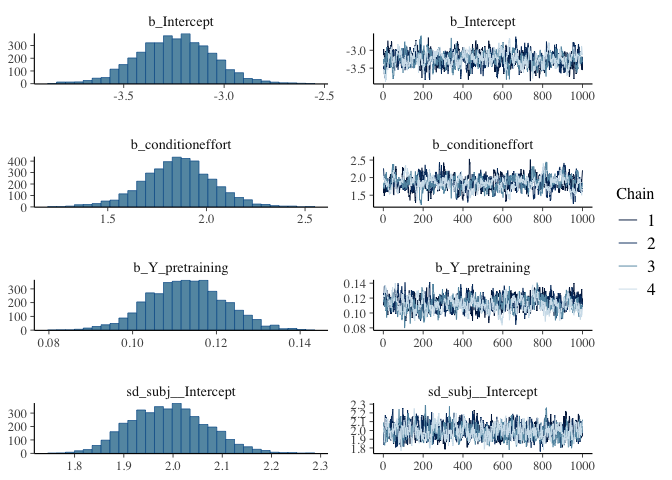

    Using 10 posterior draws for ppc type 'dens_overlay' by default.

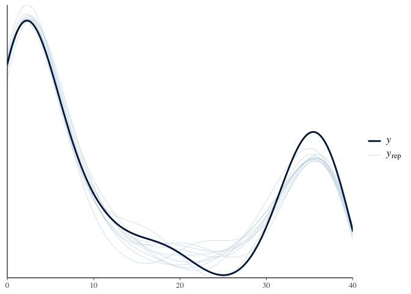

As shown in the rank histogram in
<a href="#fig-rank-hist-fit1" class="quarto-xref">Figure 1</a> below,
the chains mixed well.

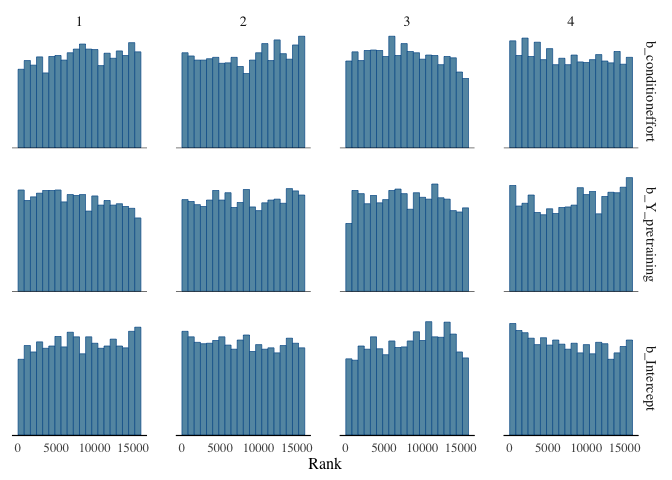

Figure 1: Rank histogram of the posterior distributions of model
parameters.

<a href="#tbl-summ-fit1" class="quarto-xref">Table 7</a> shows the
posterior distributions of b_conditioneffort, b_Y_pretraining,
b_Intercept.

Table 7: Posterior summary of the model parameters.

| variable          |  mean | median |   sd |  mad |    q5 |   q95 | rhat | ess_bulk | ess_tail |
|:------------------|------:|-------:|-----:|-----:|------:|------:|-----:|---------:|---------:|
| b_conditioneffort |  1.87 |   1.86 | 0.19 | 0.19 |  1.56 |  2.18 | 1.01 |  1206.10 |  2499.22 |
| b_Y_pretraining   |  0.11 |   0.11 | 0.01 | 0.01 |  0.10 |  0.13 | 1.00 |  1683.11 |  3296.82 |
| b_Intercept       | -3.24 |  -3.24 | 0.19 | 0.19 | -3.56 | -2.94 | 1.00 |  1569.23 |  3360.88 |

The analysis showed that effort preferences in rewarded trials under
effort conditions were significantly higher than those in the
performance condition., with a posterior mean of 1.87 and a 90% CI of
\[1.56, 2.18\].

> Do effort preferences on rewarded trials in the training section
> differ between the effort and neutral conditions? (model2)

## Analysis

We used 4 chains, each with 8,000 iterations (first 4,000 as warm-ups).

# Results

     Family: binomial 
      Links: mu = logit 
    Formula: Y_reward | trials(N_reward) ~ condition + Y_pretraining + (1 | subj) 
       Data: dtdotavgwide[condition %in% e_vs_n] (Number of observations: 506) 
      Draws: 4 chains, each with iter = 8000; warmup = 4000; thin = 1;
             total post-warmup draws = 16000

    Multilevel Hyperparameters:
    ~subj (Number of levels: 506) 
                  Estimate Est.Error l-95% CI u-95% CI Rhat Bulk_ESS Tail_ESS
    sd(Intercept)     1.97      0.08     1.82     2.13 1.00     3192     6615

    Regression Coefficients:
                    Estimate Est.Error l-95% CI u-95% CI Rhat Bulk_ESS Tail_ESS
    Intercept          -2.91      0.19    -3.28    -2.55 1.00     1546     3512
    conditioneffort     1.44      0.18     1.09     1.79 1.00     1078     2003
    Y_pretraining       0.12      0.01     0.10     0.14 1.00     1702     3508

    Draws were sampled using sampling(NUTS). For each parameter, Bulk_ESS
    and Tail_ESS are effective sample size measures, and Rhat is the potential
    scale reduction factor on split chains (at convergence, Rhat = 1).

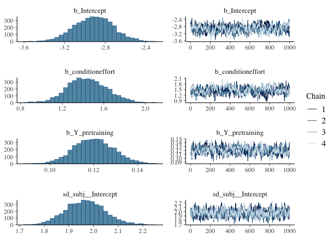

    Using 10 posterior draws for ppc type 'dens_overlay' by default.

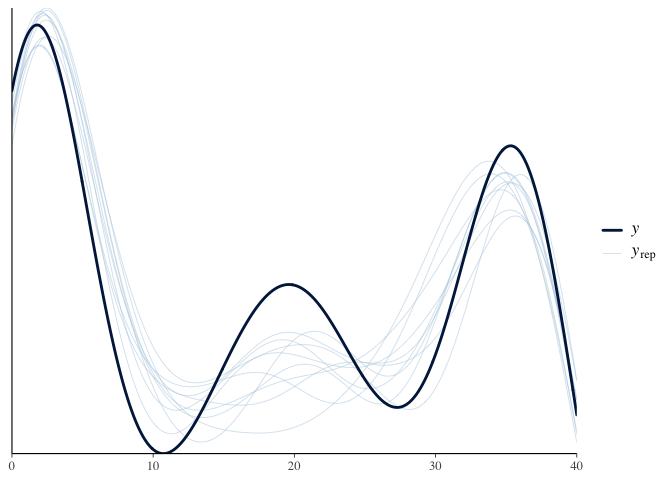

As shown in the rank histogram in
<a href="#fig-rank-hist-fit2" class="quarto-xref">Figure 2</a> below,
the chains mixed well.

Figure 2: Rank histogram of the posterior distributions of model
parameters.

<a href="#tbl-summ-fit2" class="quarto-xref">Table 8</a> shows the
posterior distributions of b_conditioneffort, b_Y_pretraining,
b_Intercept.

Table 8: Posterior summary of the model parameters.

| variable          |  mean | median |   sd |  mad |    q5 |   q95 | rhat | ess_bulk | ess_tail |
|:------------------|------:|-------:|-----:|-----:|------:|------:|-----:|---------:|---------:|
| b_conditioneffort |  1.44 |   1.44 | 0.18 | 0.18 |  1.15 |  1.74 |    1 |  1077.57 |  2002.97 |
| b_Y_pretraining   |  0.12 |   0.12 | 0.01 | 0.01 |  0.10 |  0.13 |    1 |  1701.65 |  3507.81 |
| b_Intercept       | -2.91 |  -2.91 | 0.19 | 0.19 | -3.23 | -2.60 |    1 |  1545.54 |  3511.61 |

The analysis showed that effort preferences in rewarded trials under
effort conditions were significantly higher than those in the neutral
condition., with a posterior mean of 1.44 and a 90% CI of \[1.15,
1.74\].

> Do effort preferences on probe (unrewarded) trials in the training
> section differ between the effort and performance conditions? (model3)

## Analysis

We used 4 chains, each with 8,000 iterations (first 4,000 as warm-ups).

# Results

     Family: binomial 
      Links: mu = logit 
    Formula: Y_probe | trials(N_probe) ~ condition + Y_pretraining + (1 | subj) 
       Data: dtdotavgwide[condition %in% e_vs_p] (Number of observations: 509) 
      Draws: 4 chains, each with iter = 8000; warmup = 4000; thin = 1;
             total post-warmup draws = 16000

    Multilevel Hyperparameters:
    ~subj (Number of levels: 509) 
                  Estimate Est.Error l-95% CI u-95% CI Rhat Bulk_ESS Tail_ESS
    sd(Intercept)     1.64      0.07     1.51     1.78 1.00     4921     9343

    Regression Coefficients:
                    Estimate Est.Error l-95% CI u-95% CI Rhat Bulk_ESS Tail_ESS
    Intercept          -1.84      0.16    -2.15    -1.53 1.00     3035     5690
    conditioneffort     0.24      0.16    -0.06     0.55 1.00     2720     5386
    Y_pretraining       0.08      0.01     0.06     0.09 1.00     2758     5739

    Draws were sampled using sampling(NUTS). For each parameter, Bulk_ESS
    and Tail_ESS are effective sample size measures, and Rhat is the potential
    scale reduction factor on split chains (at convergence, Rhat = 1).

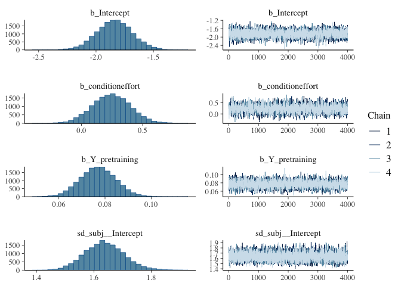

    Using 10 posterior draws for ppc type 'dens_overlay' by default.

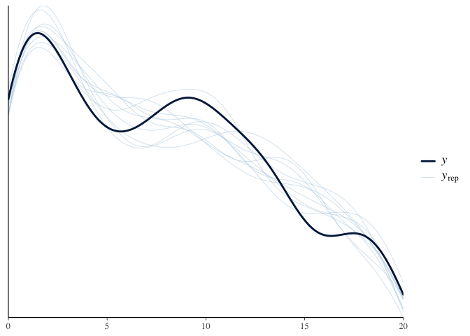

As shown in the rank histogram in
<a href="#fig-rank-hist-fit3" class="quarto-xref">Figure 3</a> below,
the chains mixed well.

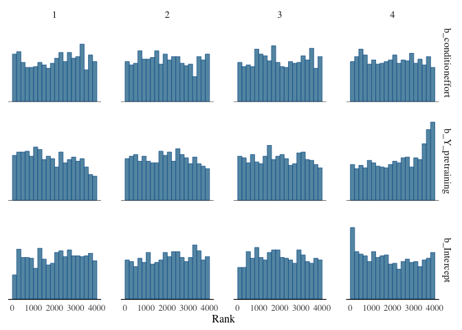

Figure 3: Rank histogram of the posterior distributions of model
parameters.

<a href="#tbl-summ-fit3" class="quarto-xref">Table 9</a> shows the
posterior distributions of b_conditioneffort, b_Y_pretraining,
b_Intercept.

Table 9: Posterior summary of the model parameters.

| variable          |  mean | median |   sd |  mad |    q5 |   q95 | rhat | ess_bulk | ess_tail |
|:------------------|------:|-------:|-----:|-----:|------:|------:|-----:|---------:|---------:|
| b_conditioneffort |  0.24 |   0.24 | 0.16 | 0.16 | -0.01 |  0.50 |    1 |  2719.87 |  5386.30 |
| b_Y_pretraining   |  0.08 |   0.08 | 0.01 | 0.01 |  0.06 |  0.09 |    1 |  2758.12 |  5739.34 |
| b_Intercept       | -1.84 |  -1.84 | 0.16 | 0.15 | -2.09 | -1.58 |    1 |  3035.43 |  5689.78 |

The analysis showed that effort preferences in probe trials under effort
conditions were not significantly higher than those in the performance
condition., with a posterior mean of 0.24 and a 90% CI of \[-0.01,
0.5\].

> Do effort preferences on probe (unrewarded) trials in the training
> section differ between the effort and neutral conditons? (model4)

## Analysis

We used 4 chains, each with 8,000 iterations (first 4,000 as warm-ups).

# Results

     Family: binomial 
      Links: mu = logit 
    Formula: Y_probe | trials(N_probe) ~ condition + Y_pretraining + (1 | subj) 
       Data: dtdotavgwide[condition %in% e_vs_n] (Number of observations: 506) 
      Draws: 4 chains, each with iter = 8000; warmup = 4000; thin = 1;
             total post-warmup draws = 16000

    Multilevel Hyperparameters:
    ~subj (Number of levels: 506) 
                  Estimate Est.Error l-95% CI u-95% CI Rhat Bulk_ESS Tail_ESS
    sd(Intercept)     1.45      0.06     1.33     1.57 1.00     4604     9098

    Regression Coefficients:
                    Estimate Est.Error l-95% CI u-95% CI Rhat Bulk_ESS Tail_ESS
    Intercept          -1.89      0.14    -2.17    -1.62 1.00     4062     7251
    conditioneffort     0.23      0.14    -0.04     0.50 1.00     3176     5661
    Y_pretraining       0.08      0.01     0.07     0.10 1.00     3983     7182

    Draws were sampled using sampling(NUTS). For each parameter, Bulk_ESS
    and Tail_ESS are effective sample size measures, and Rhat is the potential
    scale reduction factor on split chains (at convergence, Rhat = 1).

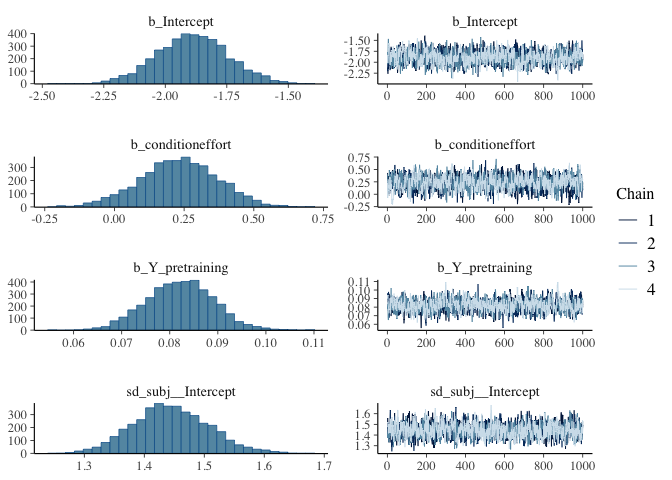

    Using 10 posterior draws for ppc type 'dens_overlay' by default.

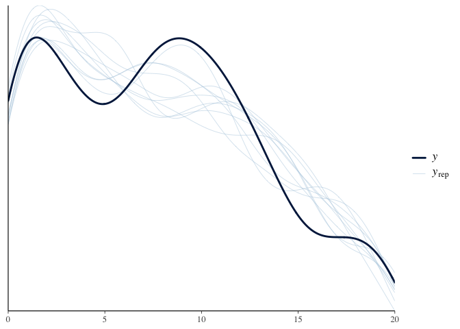

As shown in the rank histogram in
<a href="#fig-rank-hist-fit4" class="quarto-xref">Figure 4</a> below,
the chains mixed well.

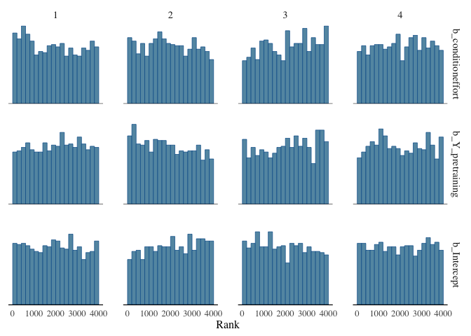

Figure 4: Rank histogram of the posterior distributions of model
parameters.

<a href="#tbl-summ-fit4" class="quarto-xref">Table 10</a> shows the
posterior distributions of b_conditioneffort, b_Y_pretraining,
b_Intercept.

Table 10: Posterior summary of the model parameters.

| variable          |   mean | median |    sd |   mad |     q5 |    q95 |  rhat | ess_bulk | ess_tail |
|:------------------|-------:|-------:|------:|------:|-------:|-------:|------:|---------:|---------:|
| b_conditioneffort |  0.229 |  0.231 | 0.138 | 0.137 |  0.001 |  0.458 | 1.001 | 3175.952 | 5661.066 |
| b_Y_pretraining   |  0.083 |  0.082 | 0.007 | 0.007 |  0.071 |  0.094 | 1.002 | 3983.270 | 7182.374 |
| b_Intercept       | -1.895 | -1.895 | 0.142 | 0.143 | -2.127 | -1.660 | 1.002 | 4062.425 | 7251.298 |

The analysis showed that effort preferences in probe trials under effort
conditions were not significantly higher than those in the neutral
condition., with a posterior mean of 0.229 and a 90% CI of \[0.001,
0.458\].

> Do effort preferences on the dot-motion task in the post-training
> section differ between the effort and performance conditions? (model5)

## Analysis

We used 4 chains, each with 8,000 iterations (first 4,000 as warm-ups).

# Results

     Family: binomial 
      Links: mu = logit 
    Formula: Y_posttraining | trials(N_posttraining) ~ condition + Y_pretraining + (1 | subj) 
       Data: dtdotavgwide[condition %in% e_vs_p] (Number of observations: 509) 
      Draws: 4 chains, each with iter = 8000; warmup = 4000; thin = 1;
             total post-warmup draws = 16000

    Multilevel Hyperparameters:
    ~subj (Number of levels: 509) 
                  Estimate Est.Error l-95% CI u-95% CI Rhat Bulk_ESS Tail_ESS
    sd(Intercept)     1.81      0.09     1.64     1.99 1.00     4003     7325

    Regression Coefficients:
                    Estimate Est.Error l-95% CI u-95% CI Rhat Bulk_ESS Tail_ESS
    Intercept          -4.01      0.20    -4.41    -3.62 1.00     4467     8137
    conditioneffort     0.50      0.18     0.15     0.85 1.00     2807     5418
    Y_pretraining       0.15      0.01     0.14     0.17 1.00     4136     7201

    Draws were sampled using sampling(NUTS). For each parameter, Bulk_ESS
    and Tail_ESS are effective sample size measures, and Rhat is the potential
    scale reduction factor on split chains (at convergence, Rhat = 1).

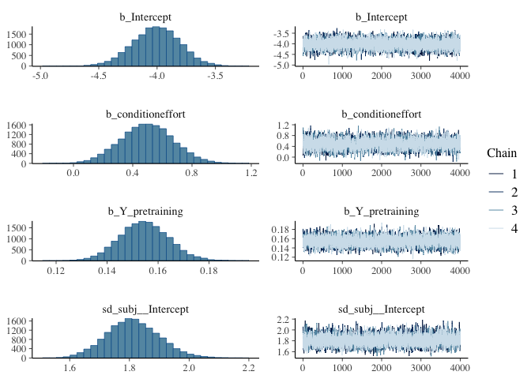

    Using 10 posterior draws for ppc type 'dens_overlay' by default.

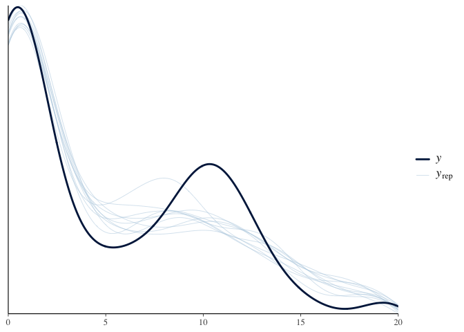

As shown in the rank histogram in
<a href="#fig-rank-hist-fit5" class="quarto-xref">Figure 5</a> below,
the chains mixed well.

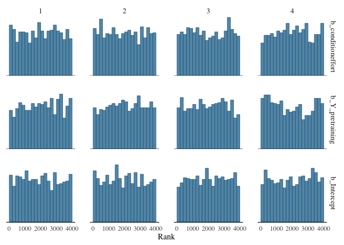

Figure 5: Rank histogram of the posterior distributions of model
parameters.

<a href="#tbl-summ-fit5" class="quarto-xref">Table 11</a> shows the
posterior distributions of b_conditioneffort, b_Y_pretraining,
b_Intercept.

Table 11: Posterior summary of the model parameters.

| variable          |  mean | median |   sd |  mad |    q5 |   q95 | rhat | ess_bulk | ess_tail |
|:------------------|------:|-------:|-----:|-----:|------:|------:|-----:|---------:|---------:|
| b_conditioneffort |  0.50 |   0.50 | 0.18 | 0.18 |  0.20 |  0.79 |    1 |  2806.89 |  5417.77 |
| b_Y_pretraining   |  0.15 |   0.15 | 0.01 | 0.01 |  0.14 |  0.17 |    1 |  4136.12 |  7201.14 |
| b_Intercept       | -4.01 |  -4.00 | 0.20 | 0.20 | -4.34 | -3.68 |    1 |  4467.24 |  8137.37 |

The analysis showed that effort preferences in post-training section
under effort conditions were significantly higher than those in the
performance condition in dot motion task, with a posterior mean of 0.5
and a 90% CI of \[0.2, 0.79\].

> Do effort preferences on the dot-motion task in the post-training
> section differ between the effort and neutral conditions? (model6)

## Analysis

We used 4 chains, each with 8,000 iterations (first 4,000 as warm-ups).

# Results

     Family: binomial 
      Links: mu = logit 
    Formula: Y_posttraining | trials(N_posttraining) ~ condition + Y_pretraining + (1 | subj) 
       Data: dtdotavgwide[condition %in% e_vs_n] (Number of observations: 506) 
      Draws: 4 chains, each with iter = 8000; warmup = 4000; thin = 1;
             total post-warmup draws = 16000

    Multilevel Hyperparameters:
    ~subj (Number of levels: 506) 
                  Estimate Est.Error l-95% CI u-95% CI Rhat Bulk_ESS Tail_ESS
    sd(Intercept)     1.74      0.09     1.58     1.92 1.00     4828     8327

    Regression Coefficients:
                    Estimate Est.Error l-95% CI u-95% CI Rhat Bulk_ESS Tail_ESS
    Intercept          -3.90      0.20    -4.30    -3.51 1.00     5056     8877
    conditioneffort     0.24      0.17    -0.10     0.57 1.00     3068     5223
    Y_pretraining       0.17      0.01     0.15     0.18 1.00     4728     7862

    Draws were sampled using sampling(NUTS). For each parameter, Bulk_ESS
    and Tail_ESS are effective sample size measures, and Rhat is the potential
    scale reduction factor on split chains (at convergence, Rhat = 1).

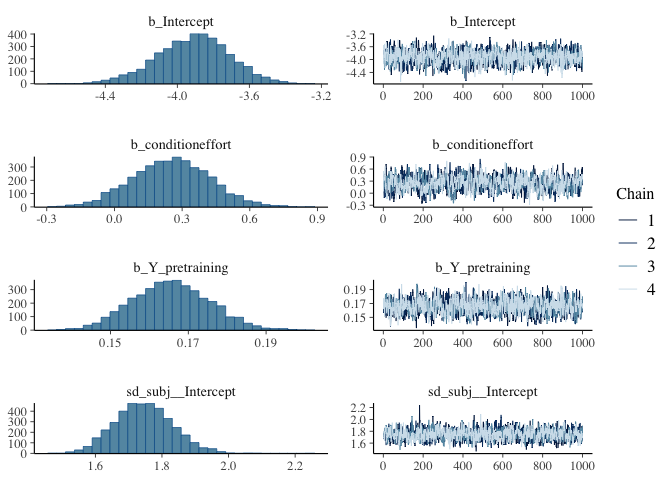

    Using 10 posterior draws for ppc type 'dens_overlay' by default.

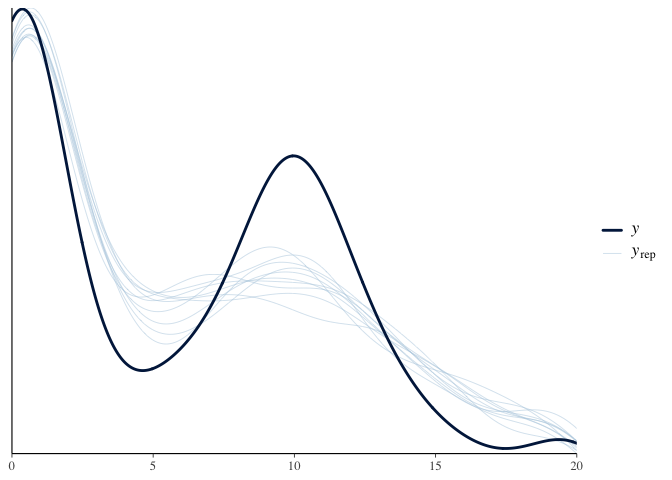

As shown in the rank histogram in
<a href="#fig-rank-hist-fit6" class="quarto-xref">Figure 6</a> below,
the chains mixed well.

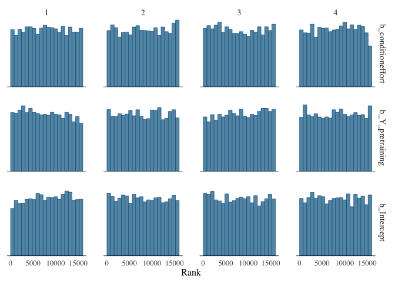

Figure 6: Rank histogram of the posterior distributions of model
parameters.

<a href="#tbl-summ-fit6" class="quarto-xref">Table 12</a> shows the
posterior distributions of b_conditioneffort, b_Y_pretraining,
b_Intercept.

Table 12: Posterior summary of the model parameters.

| variable          |  mean | median |   sd |  mad |    q5 |   q95 | rhat | ess_bulk | ess_tail |
|:------------------|------:|-------:|-----:|-----:|------:|------:|-----:|---------:|---------:|
| b_conditioneffort |  0.24 |   0.24 | 0.17 | 0.17 | -0.05 |  0.52 |    1 |  3067.97 |  5223.16 |
| b_Y_pretraining   |  0.17 |   0.17 | 0.01 | 0.01 |  0.15 |  0.18 |    1 |  4728.41 |  7862.39 |
| b_Intercept       | -3.90 |  -3.90 | 0.20 | 0.20 | -4.23 | -3.57 |    1 |  5056.04 |  8876.98 |

The analysis showed that effort preferences in post-training section
under effort conditions were not significantly higher than those in the
neutral condition in dot motion task, with a posterior mean of 0.24 and
a 90% CI of \[-0.05, 0.52\].

> Do effort preferences on the math task in the post-training section
> differ between the effort and performance conditions? (model7)

## Analysis

We used 4 chains, each with 8,000 iterations (first 4,000 as warm-ups).

# Results

     Family: binomial 
      Links: mu = logit 
    Formula: Y_posttraining | trials(N_posttraining) ~ condition + Y_pretraining + (1 | subj) 
       Data: dtmathavgwide[condition %in% e_vs_p] (Number of observations: 509) 
      Draws: 4 chains, each with iter = 8000; warmup = 4000; thin = 1;
             total post-warmup draws = 16000

    Multilevel Hyperparameters:
    ~subj (Number of levels: 509) 
                  Estimate Est.Error l-95% CI u-95% CI Rhat Bulk_ESS Tail_ESS
    sd(Intercept)     1.20      0.06     1.08     1.33 1.00     5495     8936

    Regression Coefficients:
                    Estimate Est.Error l-95% CI u-95% CI Rhat Bulk_ESS Tail_ESS
    Intercept          -4.09      0.17    -4.43    -3.77 1.00     7451    10983
    conditioneffort     0.28      0.13     0.03     0.53 1.00     4561     7405
    Y_pretraining       0.17      0.01     0.15     0.18 1.00     7192    10283

    Draws were sampled using sampling(NUTS). For each parameter, Bulk_ESS
    and Tail_ESS are effective sample size measures, and Rhat is the potential
    scale reduction factor on split chains (at convergence, Rhat = 1).

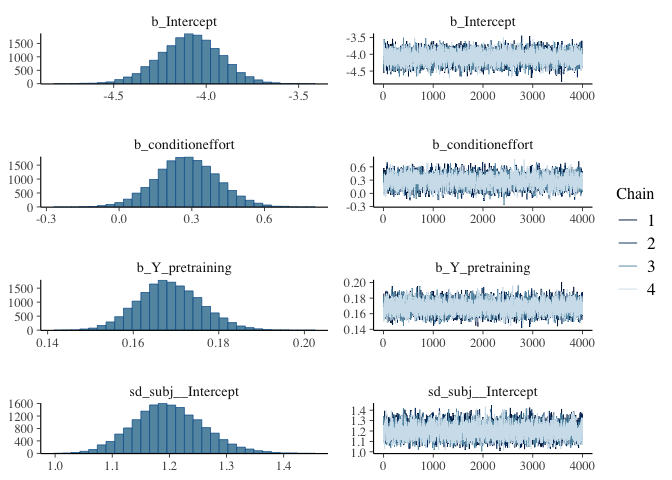

    Using 10 posterior draws for ppc type 'dens_overlay' by default.

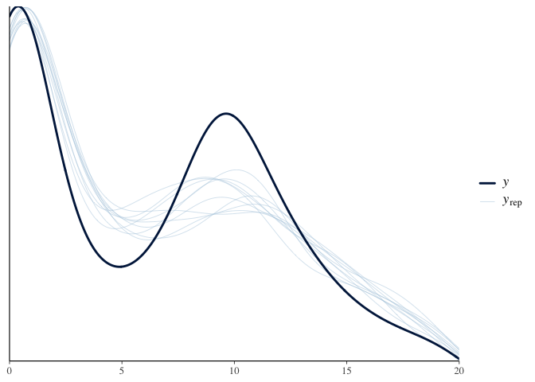

As shown in the rank histogram in
<a href="#fig-rank-hist-fit7" class="quarto-xref">Figure 7</a> below,
the chains mixed well.

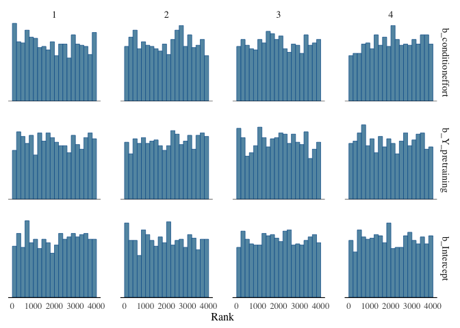

Figure 7: Rank histogram of the posterior distributions of model
parameters.

<a href="#tbl-summ-fit7" class="quarto-xref">Table 13</a> shows the
posterior distributions of b_conditioneffort, b_Y_pretraining,
b_Intercept.

Table 13: Posterior summary of the model parameters.

| variable          |  mean | median |   sd |  mad |    q5 |   q95 | rhat | ess_bulk | ess_tail |
|:------------------|------:|-------:|-----:|-----:|------:|------:|-----:|---------:|---------:|
| b_conditioneffort |  0.28 |   0.28 | 0.13 | 0.13 |  0.07 |  0.49 |    1 |  4560.71 |  7405.13 |
| b_Y_pretraining   |  0.17 |   0.17 | 0.01 | 0.01 |  0.16 |  0.18 |    1 |  7191.65 | 10283.30 |
| b_Intercept       | -4.09 |  -4.09 | 0.17 | 0.16 | -4.37 | -3.82 |    1 |  7451.10 | 10982.76 |

The analysis showed that effort preferences in post-training section
under effort conditions were significantly higher than those in the
performance condition in math task, with a posterior mean of 0.28 and a
90% CI of \[0.07, 0.49\].

> Do effort preferences on the math task in the post-training section
> differ between the effort and neutral conditions? (model8)

## Analysis

We used 4 chains, each with 8,000 iterations (first 4,000 as warm-ups).

# Results

     Family: binomial 
      Links: mu = logit 
    Formula: Y_posttraining | trials(N_posttraining) ~ condition + Y_pretraining + (1 | subj) 
       Data: dtmathavgwide[condition %in% e_vs_n] (Number of observations: 506) 
      Draws: 4 chains, each with iter = 8000; warmup = 4000; thin = 1;
             total post-warmup draws = 16000

    Multilevel Hyperparameters:
    ~subj (Number of levels: 506) 
                  Estimate Est.Error l-95% CI u-95% CI Rhat Bulk_ESS Tail_ESS
    sd(Intercept)     1.24      0.06     1.13     1.37 1.00     5083     8966

    Regression Coefficients:
                    Estimate Est.Error l-95% CI u-95% CI Rhat Bulk_ESS Tail_ESS
    Intercept          -3.81      0.17    -4.14    -3.48 1.00     7510    10724
    conditioneffort     0.20      0.13    -0.06     0.45 1.00     4572     7629
    Y_pretraining       0.16      0.01     0.14     0.17 1.00     7179    10908

    Draws were sampled using sampling(NUTS). For each parameter, Bulk_ESS
    and Tail_ESS are effective sample size measures, and Rhat is the potential
    scale reduction factor on split chains (at convergence, Rhat = 1).

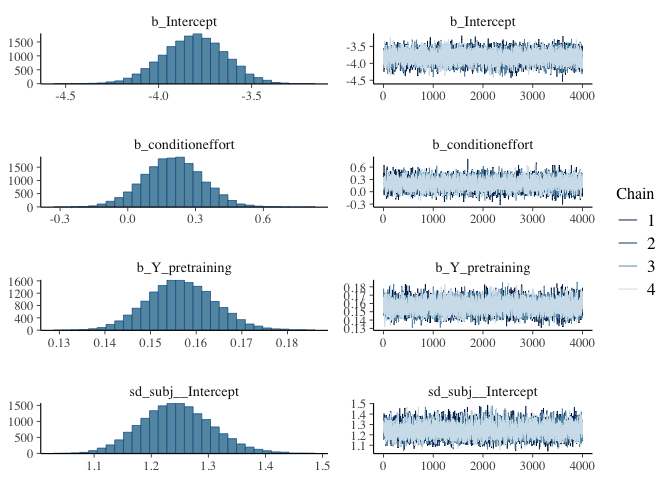

    Using 10 posterior draws for ppc type 'dens_overlay' by default.

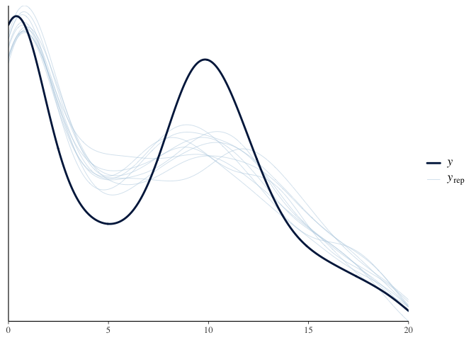

As shown in the rank histogram in
<a href="#fig-rank-hist-fit8" class="quarto-xref">Figure 8</a> below,
the chains mixed well.

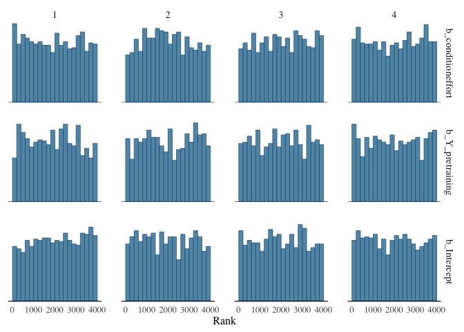

Figure 8: Rank histogram of the posterior distributions of model
parameters.

<a href="#tbl-summ-fit8" class="quarto-xref">Table 14</a> shows the
posterior distributions of b_conditioneffort, b_Y_pretraining,
b_Intercept.

Table 14: Posterior summary of the model parameters.

| variable          |  mean | median |   sd |  mad |    q5 |   q95 | rhat | ess_bulk | ess_tail |
|:------------------|------:|-------:|-----:|-----:|------:|------:|-----:|---------:|---------:|
| b_conditioneffort |  0.20 |   0.20 | 0.13 | 0.13 | -0.01 |  0.41 |    1 |  4571.73 |  7629.36 |
| b_Y_pretraining   |  0.16 |   0.16 | 0.01 | 0.01 |  0.14 |  0.17 |    1 |  7178.82 | 10907.52 |
| b_Intercept       | -3.81 |  -3.81 | 0.17 | 0.17 | -4.09 | -3.54 |    1 |  7509.76 | 10724.04 |

The analysis showed that effort preferences in post-training section
under effort conditions were not significantly higher than those in the
neutral condition in math task, with a posterior mean of 0.2 and a 90%
CI of \[-0.01, 0.41\].
