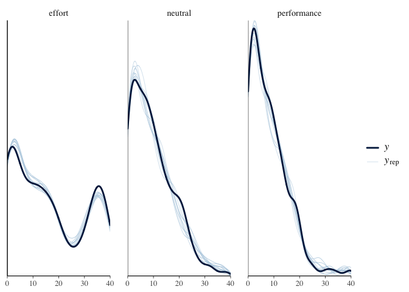

# HW 8
Shuning Wang, April Luo, Chang Lu
2024-12-05

- [Research Question](#research-question)
- [Variables in dtdotavgwide (dotmotion task
  dataset)](#variables-in-dtdotavgwide-dotmotion-task-dataset)
- [Variables in dtmathavgwide (math task
  dataset)](#variables-in-dtmathavgwide-math-task-dataset)
  - [Data Import](#data-import)
  - [Variable Summary](#variable-summary)
  - [Analysis](#analysis)
- [Results](#results)
  - [Analysis](#analysis-1)
- [Results](#results-1)
  - [Analysis](#analysis-2)
- [Results](#results-2)

# Research Question

> Do effort preferences on rewarded trials in the training section
> differ between the effort and performance conditions? (model1)

> Do effort preferences on rewarded trials in the training section
> differ between the effort and neutral conditions? (model1)

> Do effort preferences on probe (unrewarded) trials in the training
> section differ between the effort and performance conditions? (model1)

> Do effort preferences on probe (unrewarded) trials in the training
> section differ between the effort and neutral conditons? (model1)

> Do effort preferences on the dot-motion task in the post-training
> section differ between the effort and performance conditions? (model2)

> Do effort preferences on the dot-motion task in the post-training
> section differ between the effort and neutral conditions? (model2)

> Do effort preferences on the math task in the post-training section
> differ between the effort and performance conditions? (model3)

> Do effort preferences on the math task in the post-training section
> differ between the effort and neutral conditions? (model3)

\#Summary of the study design:

The entire study is divided into three sections: the pre-training
section, the training section, and the post-training section. The
pre-training section includes two types of cognitive tasks: the dot
motion task and the math task. This section is designed to establish a
baseline for participants regarding their effort expenditure. The
training section is further divided into reward trials and probe trials
(unrewarded), with three conditions: reward, performance, and neutral.
It employs a between-subjects design to manipulate participants’ effort
preferences based on the different conditions, but it includes only one
cognitive task, which is the dot motion task. In the post-training
section, two cognitive tasks are included: the dot motion task and the
math task. The dot motion task aims to demonstrate that the manipulation
in the training section has a lasting effect over time. Meanwhile, the
math task is designed to show that this training not only has a
sustained effect on the same task but also exerts an influence across
different tasks.

# Variables in dtdotavgwide (dotmotion task dataset)

- `condition`: performance(The higher the accuracy of the task, the
  greater the reward), effort(Choosing the hard task yields a high
  reward, while choosing the easy task results in a low reward),
  neutral(The reward is a fixed value.).
- `reward`: The proportion of participants choosing the hard difficulty
  task in the reward trials during the training section (N_reward = 40
  for each subject).
- `Y_reward`: The number of trials in which participants chose the hard
  difficulty task during the reward trials in the training section
  (Y_reward =reward \* N_reward).
- `probe`: The proportion of participants choosing the hard difficulty
  task in the unreward trials during the training section (N_probe = 20
  for each subject).
- `Y_probe`: The number of trials in which participants chose the hard
  difficulty task during the unreward trials in the training section
  (Y_reward = probe \* N_probe).
- `pre_training`: The proportion of participants choosing the hard
  difficulty task in the trials of the pre-training section
  (N_pretraining = 40).
- `Y_pretraining`: The number of trials in which participants chose the
  hard difficulty task during the trials in the pre-training section
  (Y_pretraining = pre_training \* N_pretraining).
- `post_training`: The proportion of participants choosing the hard
  difficulty task in the trials of the post_training section
  (N_posttraining = 20).
- `Y_posttraining`: The number of trials in which participants chose the
  hard difficulty task during the trials in the post-training section
  (Y_posttraining = post_training \* N_posttraining).

# Variables in dtmathavgwide (math task dataset)

The math task will not appear in the training section (reward trials +
probe trials), so the math task dataset does not include any probe or
reward trials. - `condition`: Same as above. - `pre_training`: Same as
above. - `Y_pretraining`: Same as above. - `post_training`: Same as
above. - `Y_posttraining`: Same as above.

## Data Import

## Variable Summary

Table <a href="#tbl-summ-var1" class="quarto-xref">Table 1</a> displays
the summary statistics of effort preferences for the dot motion task in
the pre-training(baseline) section by condition.

Table 1: Descriptive statistics by condition for effort preferences for
the dot motion task in the pre-training section

|               |           | performance | neutral | effort   |
|---------------|-----------|-------------|---------|----------|
| Y_pretraining | N         | 254         | 252     | 255      |
|               | Mean      | 14.37       | 13.99   | 14.04    |
|               | SD        | 10.87       | 9.76    | 10.20    |
|               | Min       | 0.00        | 0.00    | 0.00     |
|               | Max       | 40.00       | 40.00   | 40.00    |
|               | Histogram | ▇▁▁▁▄▆▁ ▁   | ▇▂▁▃▅▆▁ | ▇▁▁▂▆▄▁▁ |

Table <a href="#tbl-summ-var2" class="quarto-xref">Table 2</a> displays
the summary statistics of effort preferences for the dot motion task
during the rewarded trials in the training section, categorized by
condition.

Table 2: Descriptive statistics by condition for effort preferences on
rewarded trials in the training section for the dot motion task

|          |           | performance | neutral    | effort |
|----------|-----------|-------------|------------|--------|
| Y_reward | N         | 254         | 252        | 255    |
|          | Mean      | 23.55       | 12.87      | 9.89   |
|          | SD        | 14.72       | 10.37      | 9.85   |
|          | Min       | 0.00        | 0.00       | 0.00   |
|          | Max       | 40.00       | 40.00      | 40.00  |
|          | Histogram | ▆ ▁▁▁▁▂▂▇▆  | ▇▃▁▂▃▃▁▁ ▁ | ▇▃▂▁▂▁ |

Table <a href="#tbl-summ-var3" class="quarto-xref">Table 3</a> displays
the summary statistics of effort preferences for the dot motion task
during the unrewarded trials (probe trials) in the training section,
categorized by condition.

Table 3: Descriptive statistics by condition for effort preferences on
unrewarded trials (probe trials) in the training section for the dot
motion task

|         |           | performance | neutral    | effort     |
|---------|-----------|-------------|------------|------------|
| Y_probe | N         | 254         | 252        | 255        |
|         | Mean      | 8.57        | 7.53       | 7.60       |
|         | SD        | 6.35        | 4.93       | 5.55       |
|         | Min       | 0.00        | 0.00       | 0.00       |
|         | Max       | 20.00       | 20.00      | 20.00      |
|         | Histogram | ▇▃▂▃▃▃▂▁▂▂  | ▇▄▄▆▅▄▃▁▁▁ | ▇▃▄▃▄▂▃▁▂▁ |

Table <a href="#tbl-summ-var4" class="quarto-xref">Table 4</a> displays
the summary statistics of effort preferences for the dot motion task in
the post-training section by condition.

Table 4: Descriptive statistics by condition for effort preferences for
the dot motion task in the post-training section

|                |           | performance | neutral | effort  |
|----------------|-----------|-------------|---------|---------|
| Y_posttraining | N         | 254         | 252     | 255     |
|                | Mean      | 7.09        | 6.07    | 5.32    |
|                | SD        | 6.51        | 5.40    | 5.39    |
|                | Min       | 0.00        | 0.00    | 0.00    |
|                | Max       | 20.00       | 20.00   | 20.00   |
|                | Histogram | ▇ ▁▁▃▂▁▁ ▁  | ▇▁▁▁▄▁▁ | ▇▂▁▁▂▂▁ |

Table <a href="#tbl-summ-var5" class="quarto-xref">Table 5</a> displays
the summary statistics of effort preferences for the math task in the
pre-training section by condition.

Table 5: Descriptive statistics by condition for effort preferences for
the math task in the pre-training section

|               |           | performance | neutral   | effort     |
|---------------|-----------|-------------|-----------|------------|
| Y_pretraining | N         | 254         | 252       | 255        |
|               | Mean      | 15.60       | 16.75     | 15.32      |
|               | SD        | 10.78       | 9.88      | 10.12      |
|               | Min       | 0.00        | 0.00      | 0.00       |
|               | Max       | 36.00       | 40.00     | 40.00      |
|               | Histogram | ▇▁▁▂▂▄▄▂▂▁  | ▆▂▃▄▇▇▄▂▁ | ▇▂▂▄▆▅▃▁▁▁ |

Table <a href="#tbl-summ-var6" class="quarto-xref">Table 6</a> displays
the summary statistics of effort preferences for the math task in the
post-training section by condition.

Table 6: Descriptive statistics by condition for effort preferences for
the math task in the post-training section

|                |           | performance | neutral  | effort   |
|----------------|-----------|-------------|----------|----------|
| Y_posttraining | N         | 254         | 252      | 255      |
|                | Mean      | 7.13        | 6.81     | 6.05     |
|                | SD        | 6.07        | 5.38     | 5.40     |
|                | Min       | 0.00        | 0.00     | 0.00     |
|                | Max       | 20.00       | 20.00    | 20.00    |
|                | Histogram | ▇▁▁▁▄▂▁▁▁▁  | ▇▂▂▂▄▄▁▁ | ▇▁▁▂▃▂▁▁ |

> Do effort preferences on rewarded trials in the training section
> differ between the effort and performance conditions? (model1)

> Do effort preferences on rewarded trials in the training section
> differ between the effort and neutral conditions? (model1)

> Do effort preferences on probe (unrewarded) trials in the training
> section differ between the effort and performance conditions? (model1)

> Do effort preferences on probe (unrewarded) trials in the training
> section differ between the effort and neutral conditons? (model1)

## Analysis

We used 4 chains, each with 8,000 iterations (first 4,000 as warm-ups).

# Results

     Family: binomial 
      Links: mu = logit 
    Formula: Y_training | trials(N_training) ~ trainingTrialType * (condition + pre_training) + (trainingTrialType | subj) 
       Data: dotCombineRewardProbe (Number of observations: 1522) 
      Draws: 4 chains, each with iter = 8000; warmup = 4000; thin = 1;
             total post-warmup draws = 16000

    Multilevel Hyperparameters:
    ~subj (Number of levels: 761) 
                                           Estimate Est.Error l-95% CI u-95% CI
    sd(Intercept)                              1.47      0.05     1.38     1.58
    sd(trainingTrialTypereward)                1.71      0.06     1.60     1.83
    cor(Intercept,trainingTrialTypereward)    -0.35      0.04    -0.43    -0.27
                                           Rhat Bulk_ESS Tail_ESS
    sd(Intercept)                          1.00     4838     8994
    sd(trainingTrialTypereward)            1.00     3433     7119
    cor(Intercept,trainingTrialTypereward) 1.00     2645     6178

    Regression Coefficients:
                                                 Estimate Est.Error l-95% CI
    Intercept                                       -1.63      0.14    -1.90
    trainingTrialTypereward                          0.32      0.16     0.01
    conditionneutral                                -0.23      0.14    -0.50
    conditionperformance                            -0.22      0.14    -0.51
    pre_training                                     3.14      0.24     2.68
    trainingTrialTypereward:conditionneutral        -1.22      0.17    -1.56
    trainingTrialTypereward:conditionperformance    -1.65      0.17    -1.98
    trainingTrialTypereward:pre_training             1.22      0.28     0.67
                                                 u-95% CI Rhat Bulk_ESS Tail_ESS
    Intercept                                       -1.36 1.00     2903     5113
    trainingTrialTypereward                          0.63 1.00     2621     5494
    conditionneutral                                 0.05 1.00     2186     4750
    conditionperformance                             0.05 1.00     2298     5072
    pre_training                                     3.60 1.00     3070     5990
    trainingTrialTypereward:conditionneutral        -0.88 1.00     1883     4494
    trainingTrialTypereward:conditionperformance    -1.32 1.00     1810     4490
    trainingTrialTypereward:pre_training             1.77 1.00     2954     5468

    Draws were sampled using sampling(NUTS). For each parameter, Bulk_ESS
    and Tail_ESS are effective sample size measures, and Rhat is the potential
    scale reduction factor on split chains (at convergence, Rhat = 1).

    Using 10 posterior draws for ppc type 'dens_overlay' by default.

    Using 10 posterior draws for ppc type 'dens_overlay_grouped' by default.

    Using 10 posterior draws for ppc type 'dens_overlay_grouped' by default.

Figure 1: Rank histogram of the posterior distributions of model
parameters.

<a href="#tbl-summ-fit1" class="quarto-xref">Table 7</a> shows the
posterior distributions

Table 7: Posterior summary of the model parameters.

| variable | mean | median | sd | mad | q5 | q95 | rhat | ess_bulk | ess_tail |
|:---|---:|---:|---:|---:|---:|---:|---:|---:|---:|
| b_Intercept | -1.63 | -1.62 | 0.14 | 0.14 | -1.85 | -1.40 | 1 | 2903.12 | 5112.88 |
| b_trainingTrialTypereward | 0.32 | 0.32 | 0.16 | 0.16 | 0.06 | 0.58 | 1 | 2620.80 | 5493.50 |
| b_conditionneutral | -0.23 | -0.23 | 0.14 | 0.14 | -0.46 | 0.00 | 1 | 2186.23 | 4750.44 |
| b_conditionperformance | -0.22 | -0.22 | 0.14 | 0.15 | -0.46 | 0.01 | 1 | 2297.58 | 5071.97 |
| b_pre_training | 3.14 | 3.14 | 0.24 | 0.24 | 2.75 | 3.53 | 1 | 3069.75 | 5989.59 |
| b_trainingTrialTypereward:conditionneutral | -1.22 | -1.22 | 0.17 | 0.17 | -1.50 | -0.94 | 1 | 1883.17 | 4494.14 |
| b_trainingTrialTypereward:conditionperformance | -1.65 | -1.65 | 0.17 | 0.17 | -1.93 | -1.37 | 1 | 1810.40 | 4490.34 |
| b_trainingTrialTypereward:pre_training | 1.22 | 1.22 | 0.28 | 0.28 | 0.76 | 1.68 | 1 | 2954.37 | 5468.06 |
| sd_subj\_\_Intercept | 1.47 | 1.47 | 0.05 | 0.05 | 1.39 | 1.56 | 1 | 4837.65 | 8994.34 |
| sd_subj\_\_trainingTrialTypereward | 1.71 | 1.71 | 0.06 | 0.06 | 1.61 | 1.81 | 1 | 3433.31 | 7119.44 |

| variable             |  mean | median |   sd |  mad |    q5 |   q95 | rhat | ess_bulk | ess_tail |
|:---------------------|------:|-------:|-----:|-----:|------:|------:|-----:|---------:|---------:|
| b_reward_effort      |  0.32 |   0.32 | 0.16 | 0.16 |  0.06 |  0.58 |    1 |  2620.80 |  5493.50 |
| b_reward_neutral     | -0.90 |  -0.90 | 0.16 | 0.16 | -1.17 | -0.64 |    1 |  2315.30 |  5894.75 |
| b_reward_performance | -1.33 |  -1.33 | 0.16 | 0.16 | -1.59 | -1.07 |    1 |  3104.52 |  6064.55 |

| variable            |  mean | median |   sd |  mad |    q5 |  q95 | rhat | ess_bulk | ess_tail |
|:--------------------|------:|-------:|-----:|-----:|------:|-----:|-----:|---------:|---------:|
| b_probe_effort      |  0.00 |   0.00 | 0.00 | 0.00 |  0.00 | 0.00 |   NA |       NA |       NA |
| b_probe_neutral     | -0.23 |  -0.23 | 0.14 | 0.14 | -0.46 | 0.00 |    1 |  2186.23 |  4750.44 |
| b_probe_performance | -0.22 |  -0.22 | 0.14 | 0.15 | -0.46 | 0.01 |    1 |  2297.58 |  5071.97 |

    Setting all 'trials' variables to 1 by default if not specified otherwise.

    Warning: Using `size` aesthetic for lines was deprecated in ggplot2 3.4.0.
    ℹ Please use `linewidth` instead.

    $emmeans
    condition = effort:
     trainingTrialType  prob lower.HPD upper.HPD
     probe             0.374     0.326     0.418
     reward            0.559     0.498     0.615

    condition = neutral:
     trainingTrialType  prob lower.HPD upper.HPD
     probe             0.322     0.279     0.364
     reward            0.229     0.189     0.273

    condition = performance:
     trainingTrialType  prob lower.HPD upper.HPD
     probe             0.323     0.280     0.366
     reward            0.163     0.131     0.195

    Point estimate displayed: median 
    Results are back-transformed from the logit scale 
    HPD interval probability: 0.95 

    $contrasts
    condition = effort:
     contrast       odds.ratio lower.HPD upper.HPD
     probe / reward      0.472     0.367      0.59

    condition = neutral:
     contrast       odds.ratio lower.HPD upper.HPD
     probe / reward      1.598     1.247      2.00

    condition = performance:
     contrast       odds.ratio lower.HPD upper.HPD
     probe / reward      2.460     1.914      3.06

    Point estimate displayed: median 
    Results are back-transformed from the log odds ratio scale 
    HPD interval probability: 0.95 

> Do effort preferences on the dot-motion task in the post-training
> section differ between the effort and performance conditions? (model2)

> Do effort preferences on the dot-motion task in the post-training
> section differ between the effort and neutral conditions? (model2)

## Analysis

We used 4 chains, each with 8,000 iterations (first 4,000 as warm-ups).

# Results

     Family: binomial 
      Links: mu = logit 
    Formula: Y_posttraining | trials(N_posttraining) ~ condition + pre_training + (1 | subj) 
       Data: dtdotavgwide (Number of observations: 761) 
      Draws: 4 chains, each with iter = 8000; warmup = 4000; thin = 1;
             total post-warmup draws = 16000

    Multilevel Hyperparameters:
    ~subj (Number of levels: 761) 
                  Estimate Est.Error l-95% CI u-95% CI Rhat Bulk_ESS Tail_ESS
    sd(Intercept)     1.73      0.07     1.60     1.87 1.00     3652     6284

    Regression Coefficients:
                         Estimate Est.Error l-95% CI u-95% CI Rhat Bulk_ESS
    Intercept               -3.39      0.17    -3.74    -3.05 1.00     3492
    conditionneutral        -0.24      0.17    -0.58     0.10 1.00     2254
    conditionperformance    -0.49      0.17    -0.83    -0.16 1.00     2229
    pre_training             5.93      0.31     5.35     6.55 1.00     3367
                         Tail_ESS
    Intercept                5778
    conditionneutral         3757
    conditionperformance     4426
    pre_training             6140

    Draws were sampled using sampling(NUTS). For each parameter, Bulk_ESS
    and Tail_ESS are effective sample size measures, and Rhat is the potential
    scale reduction factor on split chains (at convergence, Rhat = 1).

    Using 10 posterior draws for ppc type 'dens_overlay' by default.

    Using 10 posterior draws for ppc type 'dens_overlay_grouped' by default.

As shown in the rank histogram in
<a href="#fig-rank-hist-fit2" class="quarto-xref">Figure 2</a> below,
the chains didn’t mix well.

Figure 2: Rank histogram of the posterior distributions of model
parameters.

<a href="#tbl-summ-fit2" class="quarto-xref">Table 8</a> shows the
posterior distributions of “b_conditionperformance”,
“b_conditionneutral”, “b_pre_training”, “b_Intercept”.

Table 8: Posterior summary of the model parameters.

| variable               |  mean | median |   sd |  mad |    q5 |   q95 | rhat | ess_bulk | ess_tail |
|:-----------------------|------:|-------:|-----:|-----:|------:|------:|-----:|---------:|---------:|
| b_conditionperformance | -0.49 |  -0.49 | 0.17 | 0.16 | -0.77 | -0.22 |    1 |  2229.44 |  4426.21 |
| b_conditionneutral     | -0.24 |  -0.24 | 0.17 | 0.17 | -0.52 |  0.04 |    1 |  2254.29 |  3756.54 |
| b_pre_training         |  5.93 |   5.92 | 0.31 | 0.31 |  5.43 |  6.44 |    1 |  3366.72 |  6139.64 |
| b_Intercept            | -3.39 |  -3.39 | 0.17 | 0.17 | -3.68 | -3.10 |    1 |  3492.45 |  5777.92 |

    Setting all 'trials' variables to 1 by default if not specified otherwise.

> Do effort preferences on the math task in the post-training section
> differ between the effort and performance conditions? (model3)

> Do effort preferences on the math task in the post-training section
> differ between the effort and neutral conditions? (model3)

## Analysis

We used 4 chains, each with 8,000 iterations (first 4,000 as warm-ups).

# Results

     Family: binomial 
      Links: mu = logit 
    Formula: Y_posttraining | trials(N_posttraining) ~ condition + pre_training + (1 | subj) 
       Data: dtmathavgwide (Number of observations: 761) 
      Draws: 4 chains, each with iter = 8000; warmup = 4000; thin = 1;
             total post-warmup draws = 16000

    Multilevel Hyperparameters:
    ~subj (Number of levels: 761) 
                  Estimate Est.Error l-95% CI u-95% CI Rhat Bulk_ESS Tail_ESS
    sd(Intercept)     1.16      0.05     1.07     1.26 1.00     4969     7696

    Regression Coefficients:
                         Estimate Est.Error l-95% CI u-95% CI Rhat Bulk_ESS
    Intercept               -3.65      0.14    -3.93    -3.38 1.00     5574
    conditionneutral        -0.20      0.12    -0.44     0.04 1.00     3702
    conditionperformance    -0.28      0.12    -0.52    -0.03 1.00     4098
    pre_training             6.40      0.23     5.96     6.87 1.00     6213
                         Tail_ESS
    Intercept                8570
    conditionneutral         7061
    conditionperformance     7030
    pre_training             9876

    Draws were sampled using sampling(NUTS). For each parameter, Bulk_ESS
    and Tail_ESS are effective sample size measures, and Rhat is the potential
    scale reduction factor on split chains (at convergence, Rhat = 1).

    Using 10 posterior draws for ppc type 'dens_overlay' by default.

    Using 10 posterior draws for ppc type 'dens_overlay_grouped' by default.

Figure 3: Rank histogram of the posterior distributions of model
parameters.

<a href="#tbl-summ-fit3" class="quarto-xref">Table 9</a> shows the
posterior distributions of “b_conditionperformance”,
“b_conditionneutral”, “b_pre_training”, “b_Intercept”.

Table 9: Posterior summary of the model parameters.

| variable               |  mean | median |   sd |  mad |    q5 |   q95 | rhat | ess_bulk | ess_tail |
|:-----------------------|------:|-------:|-----:|-----:|------:|------:|-----:|---------:|---------:|
| b_conditionperformance | -0.28 |  -0.28 | 0.12 | 0.12 | -0.48 | -0.07 |    1 |  4097.97 |  7030.26 |
| b_conditionneutral     | -0.20 |  -0.20 | 0.12 | 0.12 | -0.40 |  0.00 |    1 |  3702.47 |  7060.68 |
| b_pre_training         |  6.40 |   6.40 | 0.23 | 0.24 |  6.02 |  6.79 |    1 |  6212.74 |  9876.40 |
| b_Intercept            | -3.65 |  -3.65 | 0.14 | 0.14 | -3.89 | -3.42 |    1 |  5573.68 |  8570.32 |

    Setting all 'trials' variables to 1 by default if not specified otherwise.

