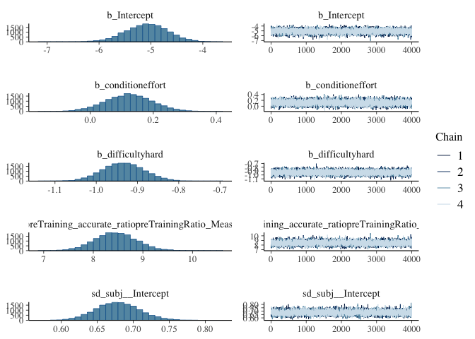
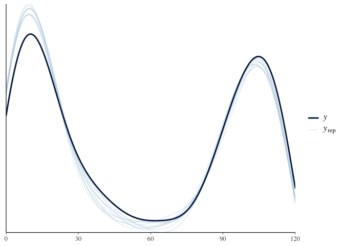
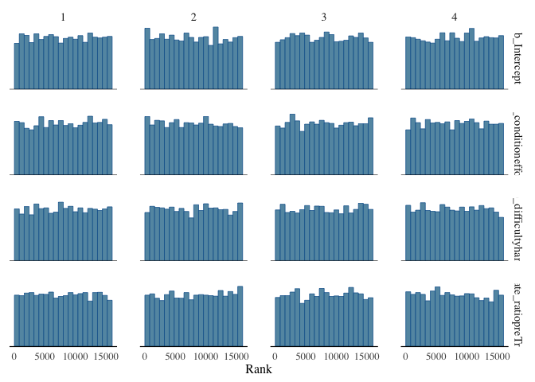

# Project_accuracy
Shuning Wang, April Luo, Chang Lu
2024-12-03

- [Data Import](#data-import)
- [Analysis](#analysis)
- [Results](#results)

## Data Import

> Does accuracy on rewarded trials in the training section differ
> between the effort and performance conditions?

## Analysis

We used 4 chains, each with 8,000 iterations (first 4,000 as warm-ups).

# Results

     Family: binomial 
      Links: mu = logit 
    Formula: Training_Reward_accurate_trialsNum | trials(Training_Reward_trialsNum) ~ condition + difficulty + me(preTraining_accurate_ratio, preTrainingRatio_MeasureError) + (1 | subj) 
       Data: dot_accuracy[condition %in% e_vs_p] (Number of observations: 926) 
      Draws: 4 chains, each with iter = 8000; warmup = 4000; thin = 1;
             total post-warmup draws = 16000

    Multilevel Hyperparameters:
    ~subj (Number of levels: 509) 
                  Estimate Est.Error l-95% CI u-95% CI Rhat Bulk_ESS Tail_ESS
    sd(Intercept)     0.68      0.03     0.62     0.74 1.00     6452    10257

    Regression Coefficients:
                                                              Estimate Est.Error
    Intercept                                                    -5.08      0.41
    conditioneffort                                               0.12      0.07
    difficultyhard                                               -0.93      0.05
    mepreTraining_accurate_ratiopreTrainingRatio_MeasureError     8.45      0.42
                                                              l-95% CI u-95% CI
    Intercept                                                    -5.89    -4.29
    conditioneffort                                              -0.03     0.27
    difficultyhard                                               -1.03    -0.84
    mepreTraining_accurate_ratiopreTrainingRatio_MeasureError     7.64     9.30
                                                              Rhat Bulk_ESS
    Intercept                                                 1.00     5764
    conditioneffort                                           1.00     7474
    difficultyhard                                            1.00    13904
    mepreTraining_accurate_ratiopreTrainingRatio_MeasureError 1.00     5791
                                                              Tail_ESS
    Intercept                                                     9600
    conditioneffort                                              10032
    difficultyhard                                               13518
    mepreTraining_accurate_ratiopreTrainingRatio_MeasureError     9513

    Draws were sampled using sampling(NUTS). For each parameter, Bulk_ESS
    and Tail_ESS are effective sample size measures, and Rhat is the potential
    scale reduction factor on split chains (at convergence, Rhat = 1).

    Using 10 posterior draws for ppc type 'dens_overlay' by default.

    Warning: Noise-free latent variables were not saved. You can control saving
    those variables via 'save_pars()'. Treating original data as if it was new data
    as a workaround.

<a href="#tbl-summ-fit1" class="quarto-xref">Table 1</a> shows the
posterior distributions of b_conditioneffort, b_Y_pretraining,
b_Intercept.

Table 1: Posterior summary of the model parameters.

| variable | mean | median | sd | mad | q5 | q95 | rhat | ess_bulk | ess_tail |
|:---|---:|---:|---:|---:|---:|---:|---:|---:|---:|
| b_Intercept | -5.078 | -5.070 | 0.406 | 0.404 | -5.748 | -4.423 | 1 | 5763.977 | 9599.82 |
| b_conditioneffort | 0.122 | 0.122 | 0.075 | 0.075 | -0.002 | 0.245 | 1 | 7474.154 | 10032.18 |
| b_difficultyhard | -0.934 | -0.934 | 0.050 | 0.050 | -1.016 | -0.852 | 1 | 13903.758 | 13517.68 |
| bsp_mepreTraining_accurate_ratiopreTrainingRatio_MeasureError | 8.454 | 8.447 | 0.419 | 0.415 | 7.779 | 9.147 | 1 | 5791.344 | 9512.93 |

