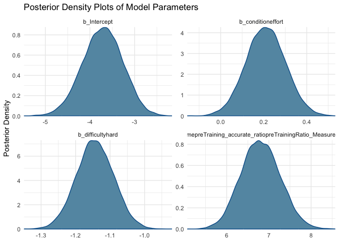

# Project_accuracy
Shuning Wang, April Luo, Chang Lu
2024-12-04

- [Data Import](#data-import)
- [Research Question](#research-question)
  - [Variable Summary](#variable-summary)
  - [Analysis](#analysis)
- [Results](#results)
  - [Analysis](#analysis-1)
- [Results](#results-1)
  - [Analysis](#analysis-2)
- [Results](#results-2)
  - [Analysis](#analysis-3)
- [Results](#results-3)
  - [Analysis](#analysis-4)
- [Results](#results-4)
  - [Analysis](#analysis-5)
- [Results](#results-5)
  - [Analysis](#analysis-6)
- [Results](#results-6)
  - [Analysis](#analysis-7)
- [Results](#results-7)

## Data Import

# Research Question

> Does accuracy on rewarded trials in the training section differ
> between the effort and performance conditions?

> Does accuracy on rewarded trials in the training section differ
> between the effort and neutral conditions?

> Does accuracy on probe (unrewarded) trials in the training section
> differ between the effort and performance conditions?

> Does accuracy on probe (unrewarded) trials in the training section
> differ between the effort and neutral conditons?

> Does accuracy on the dot motion task in the post-training section
> differ between the effort and performance conditions?

> Does accuracy on the dot motion task in the post-training section
> differ between the effort and neutral conditions?

> Does accuracy on the math task in the post-training section differ
> between the effort and performance conditions?

> Does accuracy on the math task in the post-training section differ
> between the effort and neutral conditions?

## Variable Summary

Table <a href="#tbl-summ-var1" class="quarto-xref">Table 1</a> displays
the summary statistics of accuracy for the dot motion task in the
pre-training(baseline) section by condition.

Table 1: Descriptive statistics by condition and difficulty for accuracy
for the dot motion task in the pre-training section

|  |  | performance.easy | neutral.easy | effort.easy | performance.hard | neutral.hard | effort.hard |
|----|----|----|----|----|----|----|----|
| preTraining_accurate_ratio | N | 251 | 250 | 248 | 215 | 222 | 212 |
|  | Mean | 0.95 | 0.96 | 0.96 | 0.85 | 0.86 | 0.87 |
|  | SD | 0.10 | 0.11 | 0.11 | 0.18 | 0.19 | 0.19 |
|  | Min | 0.41 | 0.20 | 0.00 | 0.29 | 0.00 | 0.00 |
|  | Max | 1.00 | 1.00 | 1.00 | 1.00 | 1.00 | 1.00 |
|  | Histogram | ▁▇ | ▇ | ▇ | ▁ ▁ ▁▃▇ | ▁ ▂▇ | ▂▇ |

Table <a href="#tbl-summ-var2" class="quarto-xref">Table 2</a> displays
the summary statistics of accuracy for the dot motion task during the
rewarded trials in the training section, categorized by condition.

Table 2: Descriptive statistics by condition and difficulty for accuracy
on rewarded trials in the training section for the dot motion task

|  |  | performance.easy | neutral.easy | effort.easy | performance.hard | neutral.hard | effort.hard |
|----|----|----|----|----|----|----|----|
| Training_Reward_accurate_trialsNum_ratio | N | 250 | 250 | 246 | 234 | 231 | 218 |
|  | Mean | 0.93 | 0.95 | 0.94 | 0.74 | 0.80 | 0.80 |
|  | SD | 0.10 | 0.08 | 0.12 | 0.23 | 0.20 | 0.22 |
|  | Min | 0.33 | 0.33 | 0.00 | 0.00 | 0.00 | 0.00 |
|  | Max | 1.00 | 1.00 | 1.00 | 1.00 | 1.00 | 0.99 |
|  | Histogram | ▂▇ | ▁▇ | ▁▇ | ▃▂▁▃▃▆▇ | ▁▁ ▁▂▄▇ | ▁ ▁▁▃▇ |

Table <a href="#tbl-summ-var3" class="quarto-xref">Table 3</a> displays
the summary statistics of accuracy for the dot motion task during the
probe trials in the training section, categorized by condition.

Table 3: Descriptive statistics by condition and difficulty for accuracy
on rewarded trials in the training section for the dot motion task

|  |  | performance.easy | neutral.easy | effort.easy | performance.hard | neutral.hard | effort.hard |
|----|----|----|----|----|----|----|----|
| Training_probe_accurate_trialsNum_ratio | N | 251 | 250 | 244 | 227 | 231 | 227 |
|  | Mean | 0.91 | 0.94 | 0.93 | 0.71 | 0.75 | 0.76 |
|  | SD | 0.14 | 0.11 | 0.13 | 0.23 | 0.22 | 0.23 |
|  | Min | 0.10 | 0.18 | 0.22 | 0.00 | 0.00 | 0.00 |
|  | Max | 1.00 | 1.00 | 1.00 | 1.00 | 1.00 | 1.00 |
|  | Histogram | ▂▇ | ▁▇ | ▁▇ | ▁ ▃▃▁▅▇▆▇ | ▁ ▁▁▁▁▃▄▇▅ | ▁ ▁▁▁▂▄▇▇ |

Table <a href="#tbl-summ-var4" class="quarto-xref">Table 4</a> displays
the summary statistics of accuracy for the dot motion task in the
post-training section by condition.

Table 4: Descriptive statistics by condition and difficulty for accuracy
for the dot motion task in the post-training section

|  |  | performance.easy | neutral.easy | effort.easy | performance.hard | neutral.hard | effort.hard |
|----|----|----|----|----|----|----|----|
| postTraining_accurate_ratio | N | 252 | 247 | 239 | 188 | 183 | 184 |
|  | Mean | 0.95 | 0.95 | 0.95 | 0.85 | 0.89 | 0.89 |
|  | SD | 0.10 | 0.09 | 0.12 | 0.21 | 0.18 | 0.18 |
|  | Min | 0.10 | 0.08 | 0.00 | 0.00 | 0.00 | 0.00 |
|  | Max | 1.00 | 1.00 | 1.00 | 1.00 | 1.00 | 1.00 |
|  | Histogram | ▇ | ▁▇ | ▇ | ▁ ▂▇ | ▂▇ | ▂▇ |

Table <a href="#tbl-summ-var5" class="quarto-xref">Table 5</a> displays
the summary statistics of accuracy for the math task in the
pre-training(baseline) section by condition.

Table 5: Descriptive statistics by condition and difficulty for accuracy
for the math task in the pre-training section

|  |  | performance.easy | neutral.easy | effort.easy | performance.hard | neutral.hard | effort.hard |
|----|----|----|----|----|----|----|----|
| preTraining_accurate_ratio | N | 254 | 251 | 254 | 224 | 228 | 217 |
|  | Mean | 0.96 | 0.98 | 0.98 | 0.86 | 0.90 | 0.89 |
|  | SD | 0.10 | 0.04 | 0.04 | 0.21 | 0.15 | 0.19 |
|  | Min | 0.19 | 0.69 | 0.68 | 0.00 | 0.00 | 0.00 |
|  | Max | 1.00 | 1.00 | 1.00 | 1.00 | 1.00 | 1.00 |
|  | Histogram | ▇ | ▁▂▇ | ▁▁▇ | ▁▂▇ | ▁▁▂▇ | ▁▁▇ |

Table <a href="#tbl-summ-var6" class="quarto-xref">Table 6</a> displays
the summary statistics of accuracy for the math task in the
post-training section by condition.

Table 6: Descriptive statistics by condition and difficulty for accuracy
for the math task in the post-training section

|  |  | performance.easy | neutral.easy | effort.easy | performance.hard | neutral.hard | effort.hard |
|----|----|----|----|----|----|----|----|
| postTraining_accurate_ratio | N | 252 | 250 | 251 | 187 | 197 | 188 |
|  | Mean | 0.96 | 0.97 | 0.97 | 0.87 | 0.90 | 0.91 |
|  | SD | 0.11 | 0.05 | 0.08 | 0.23 | 0.18 | 0.17 |
|  | Min | 0.07 | 0.75 | 0.20 | 0.00 | 0.00 | 0.00 |
|  | Max | 1.00 | 1.00 | 1.00 | 1.00 | 1.00 | 1.00 |
|  | Histogram | ▁▇ | ▁ ▁▇ | ▁▇ | ▁▁▁▇ | ▁▂▇ | ▂▇ |

> Does accuracy on rewarded trials in the training section differ
> between the effort and performance conditions?

## Analysis

We used 4 chains, each with 8,000 iterations (first 4,000 as warm-ups).

# Results

     Family: binomial 
      Links: mu = logit 
    Formula: Training_Reward_accurate_trialsNum | trials(Training_Reward_trialsNum) ~ condition + difficulty + me(preTraining_accurate_ratio, preTrainingRatio_MeasureError) + (1 | subj) 
       Data: dot_accuracy[condition %in% e_vs_p] (Number of observations: 926) 
      Draws: 4 chains, each with iter = 8000; warmup = 4000; thin = 1;
             total post-warmup draws = 16000

    Multilevel Hyperparameters:
    ~subj (Number of levels: 509) 
                  Estimate Est.Error l-95% CI u-95% CI Rhat Bulk_ESS Tail_ESS
    sd(Intercept)     0.68      0.03     0.62     0.74 1.00     6324    10154

    Regression Coefficients:
                                                              Estimate Est.Error
    Intercept                                                    -5.09      0.41
    conditioneffort                                               0.12      0.07
    difficultyhard                                               -0.93      0.05
    mepreTraining_accurate_ratiopreTrainingRatio_MeasureError     8.47      0.43
                                                              l-95% CI u-95% CI
    Intercept                                                    -5.91    -4.31
    conditioneffort                                              -0.02     0.27
    difficultyhard                                               -1.03    -0.83
    mepreTraining_accurate_ratiopreTrainingRatio_MeasureError     7.66     9.32
                                                              Rhat Bulk_ESS
    Intercept                                                 1.00     6288
    conditioneffort                                           1.00     7094
    difficultyhard                                            1.00    13387
    mepreTraining_accurate_ratiopreTrainingRatio_MeasureError 1.00     6296
                                                              Tail_ESS
    Intercept                                                     8474
    conditioneffort                                              10632
    difficultyhard                                               12707
    mepreTraining_accurate_ratiopreTrainingRatio_MeasureError     8644

    Draws were sampled using sampling(NUTS). For each parameter, Bulk_ESS
    and Tail_ESS are effective sample size measures, and Rhat is the potential
    scale reduction factor on split chains (at convergence, Rhat = 1).

    Using 10 posterior draws for ppc type 'dens_overlay' by default.

    Warning: Noise-free latent variables were not saved. You can control saving
    those variables via 'save_pars()'. Treating original data as if it was new data
    as a workaround.

Figure 1: Rank histogram of the posterior distributions of model
parameters.

<a href="#tbl-summ-fit1" class="quarto-xref">Table 7</a> shows the
posterior distributions of b_conditioneffort, b_Y_pretraining,
b_Intercept.

Table 7: Posterior summary of the model parameters.

| variable | mean | median | sd | mad | q5 | q95 | rhat | ess_bulk | ess_tail |
|:---|---:|---:|---:|---:|---:|---:|---:|---:|---:|
| b_Intercept | -5.093 | -5.088 | 0.411 | 0.412 | -5.779 | -4.429 | 1.001 | 6287.882 | 8474.063 |
| b_conditioneffort | 0.121 | 0.122 | 0.075 | 0.075 | -0.002 | 0.244 | 1.000 | 7094.300 | 10631.686 |
| b_difficultyhard | -0.933 | -0.933 | 0.051 | 0.051 | -1.017 | -0.850 | 1.001 | 13387.421 | 12707.479 |
| bsp_mepreTraining_accurate_ratiopreTrainingRatio_MeasureError | 8.469 | 8.464 | 0.425 | 0.426 | 7.776 | 9.170 | 1.001 | 6296.163 | 8643.652 |

    Warning: The following arguments were unrecognized and ignored: color

Figure 2: posterior density plot.

> Does accuracy on rewarded trials in the training section differ
> between the effort and neutral conditions?

## Analysis

We used 4 chains, each with 8,000 iterations (first 4,000 as warm-ups).

# Results

     Family: binomial 
      Links: mu = logit 
    Formula: Training_Reward_accurate_trialsNum | trials(Training_Reward_trialsNum) ~ condition + difficulty + me(preTraining_accurate_ratio, preTrainingRatio_MeasureError) + (1 | subj) 
       Data: dot_accuracy[condition %in% e_vs_n] (Number of observations: 932) 
      Draws: 4 chains, each with iter = 8000; warmup = 4000; thin = 1;
             total post-warmup draws = 16000

    Multilevel Hyperparameters:
    ~subj (Number of levels: 506) 
                  Estimate Est.Error l-95% CI u-95% CI Rhat Bulk_ESS Tail_ESS
    sd(Intercept)     0.66      0.03     0.60     0.72 1.00     4981     8588

    Regression Coefficients:
                                                              Estimate Est.Error
    Intercept                                                    -2.88      0.32
    conditioneffort                                              -0.12      0.07
    difficultyhard                                               -0.97      0.05
    mepreTraining_accurate_ratiopreTrainingRatio_MeasureError     6.42      0.33
                                                              l-95% CI u-95% CI
    Intercept                                                    -3.53    -2.26
    conditioneffort                                              -0.27     0.02
    difficultyhard                                               -1.06    -0.87
    mepreTraining_accurate_ratiopreTrainingRatio_MeasureError     5.78     7.09
                                                              Rhat Bulk_ESS
    Intercept                                                 1.00     4471
    conditioneffort                                           1.00     5604
    difficultyhard                                            1.00    10562
    mepreTraining_accurate_ratiopreTrainingRatio_MeasureError 1.00     4467
                                                              Tail_ESS
    Intercept                                                     7995
    conditioneffort                                               9318
    difficultyhard                                               11649
    mepreTraining_accurate_ratiopreTrainingRatio_MeasureError     7609

    Draws were sampled using sampling(NUTS). For each parameter, Bulk_ESS
    and Tail_ESS are effective sample size measures, and Rhat is the potential
    scale reduction factor on split chains (at convergence, Rhat = 1).

    Using 10 posterior draws for ppc type 'dens_overlay' by default.

    Warning: Noise-free latent variables were not saved. You can control saving
    those variables via 'save_pars()'. Treating original data as if it was new data
    as a workaround.

Figure 3: Rank histogram of the posterior distributions of model
parameters.

<a href="#tbl-summ-fit2" class="quarto-xref">Table 8</a> shows the
posterior distributions of b_conditioneffort, b_Y_pretraining,
b_Intercept.

Table 8: Posterior summary of the model parameters.

| variable | mean | median | sd | mad | q5 | q95 | rhat | ess_bulk | ess_tail |
|:---|---:|---:|---:|---:|---:|---:|---:|---:|---:|
| b_Intercept | -2.877 | -2.875 | 0.324 | 0.323 | -3.418 | -2.352 | 1.002 | 4471.473 | 7994.574 |
| b_conditioneffort | -0.124 | -0.123 | 0.072 | 0.071 | -0.242 | -0.007 | 1.001 | 5604.034 | 9317.926 |
| b_difficultyhard | -0.968 | -0.968 | 0.049 | 0.049 | -1.049 | -0.888 | 1.001 | 10561.526 | 11648.893 |
| bsp_mepreTraining_accurate_ratiopreTrainingRatio_MeasureError | 6.421 | 6.418 | 0.333 | 0.331 | 5.882 | 6.975 | 1.001 | 4467.278 | 7608.849 |

    Warning: The following arguments were unrecognized and ignored: color

Figure 4: posterior density plot.

> Does accuracy on probe (unrewarded) trials in the training section
> differ between the effort and performance conditions?

## Analysis

We used 4 chains, each with 8,000 iterations (first 4,000 as warm-ups).

# Results

     Family: binomial 
      Links: mu = logit 
    Formula: Training_probe_accurate_trialsNum | trials(Training_probe_trialsNum) ~ condition + difficulty + me(preTraining_accurate_ratio, preTrainingRatio_MeasureError) + (1 | subj) 
       Data: dot_accuracy[condition %in% e_vs_p] (Number of observations: 926) 
      Draws: 4 chains, each with iter = 8000; warmup = 4000; thin = 1;
             total post-warmup draws = 16000

    Multilevel Hyperparameters:
    ~subj (Number of levels: 509) 
                  Estimate Est.Error l-95% CI u-95% CI Rhat Bulk_ESS Tail_ESS
    sd(Intercept)     0.86      0.04     0.79     0.94 1.00     6566    10281

    Regression Coefficients:
                                                              Estimate Est.Error
    Intercept                                                    -3.72      0.45
    conditioneffort                                               0.21      0.09
    difficultyhard                                               -1.14      0.05
    mepreTraining_accurate_ratiopreTrainingRatio_MeasureError     6.81      0.47
                                                              l-95% CI u-95% CI
    Intercept                                                    -4.61    -2.86
    conditioneffort                                               0.03     0.39
    difficultyhard                                               -1.25    -1.04
    mepreTraining_accurate_ratiopreTrainingRatio_MeasureError     5.92     7.73
                                                              Rhat Bulk_ESS
    Intercept                                                 1.00     6408
    conditioneffort                                           1.00     6328
    difficultyhard                                            1.00    15830
    mepreTraining_accurate_ratiopreTrainingRatio_MeasureError 1.00     6400
                                                              Tail_ESS
    Intercept                                                     9382
    conditioneffort                                               9479
    difficultyhard                                               13431
    mepreTraining_accurate_ratiopreTrainingRatio_MeasureError     9173

    Draws were sampled using sampling(NUTS). For each parameter, Bulk_ESS
    and Tail_ESS are effective sample size measures, and Rhat is the potential
    scale reduction factor on split chains (at convergence, Rhat = 1).

    Using 10 posterior draws for ppc type 'dens_overlay' by default.

    Warning: Noise-free latent variables were not saved. You can control saving
    those variables via 'save_pars()'. Treating original data as if it was new data
    as a workaround.

Figure 5: Rank histogram of the posterior distributions of model
parameters.

<a href="#tbl-summ-fit3" class="quarto-xref">Table 9</a> shows the
posterior distributions of b_conditioneffort, b_Y_pretraining,
b_Intercept.

Table 9: Posterior summary of the model parameters.

| variable | mean | median | sd | mad | q5 | q95 | rhat | ess_bulk | ess_tail |
|:---|---:|---:|---:|---:|---:|---:|---:|---:|---:|
| b_Intercept | -3.717 | -3.709 | 0.447 | 0.450 | -4.460 | -2.999 | 1 | 6407.517 | 9382.219 |
| b_conditioneffort | 0.209 | 0.209 | 0.091 | 0.091 | 0.060 | 0.359 | 1 | 6328.454 | 9479.496 |
| b_difficultyhard | -1.144 | -1.144 | 0.054 | 0.054 | -1.233 | -1.055 | 1 | 15830.375 | 13431.268 |
| bsp_mepreTraining_accurate_ratiopreTrainingRatio_MeasureError | 6.806 | 6.797 | 0.465 | 0.468 | 6.055 | 7.577 | 1 | 6400.155 | 9173.172 |

    Warning: The following arguments were unrecognized and ignored: color

Figure 6: posterior density plot.

> Does accuracy on probe (unrewarded) trials in the training section
> differ between the effort and neutral conditons?

## Analysis

We used 4 chains, each with 8,000 iterations (first 4,000 as warm-ups).

# Results

     Family: binomial 
      Links: mu = logit 
    Formula: Training_probe_accurate_trialsNum | trials(Training_probe_trialsNum) ~ condition + difficulty + me(preTraining_accurate_ratio, preTrainingRatio_MeasureError) + (1 | subj) 
       Data: dot_accuracy[condition %in% e_vs_n] (Number of observations: 932) 
      Draws: 4 chains, each with iter = 8000; warmup = 4000; thin = 1;
             total post-warmup draws = 16000

    Multilevel Hyperparameters:
    ~subj (Number of levels: 506) 
                  Estimate Est.Error l-95% CI u-95% CI Rhat Bulk_ESS Tail_ESS
    sd(Intercept)     0.86      0.04     0.78     0.94 1.00     4705     7736

    Regression Coefficients:
                                                              Estimate Est.Error
    Intercept                                                    -1.97      0.41
    conditioneffort                                               0.01      0.09
    difficultyhard                                               -1.33      0.06
    mepreTraining_accurate_ratiopreTrainingRatio_MeasureError     5.28      0.43
                                                              l-95% CI u-95% CI
    Intercept                                                    -2.78    -1.17
    conditioneffort                                              -0.17     0.19
    difficultyhard                                               -1.44    -1.22
    mepreTraining_accurate_ratiopreTrainingRatio_MeasureError     4.45     6.12
                                                              Rhat Bulk_ESS
    Intercept                                                 1.00     4268
    conditioneffort                                           1.00     4252
    difficultyhard                                            1.00    11130
    mepreTraining_accurate_ratiopreTrainingRatio_MeasureError 1.00     4296
                                                              Tail_ESS
    Intercept                                                     7389
    conditioneffort                                               6703
    difficultyhard                                               11621
    mepreTraining_accurate_ratiopreTrainingRatio_MeasureError     7340

    Draws were sampled using sampling(NUTS). For each parameter, Bulk_ESS
    and Tail_ESS are effective sample size measures, and Rhat is the potential
    scale reduction factor on split chains (at convergence, Rhat = 1).

    Using 10 posterior draws for ppc type 'dens_overlay' by default.

    Warning: Noise-free latent variables were not saved. You can control saving
    those variables via 'save_pars()'. Treating original data as if it was new data
    as a workaround.

Figure 7: Rank histogram of the posterior distributions of model
parameters.

<a href="#tbl-summ-fit4" class="quarto-xref">Table 10</a> shows the
posterior distributions of b_conditioneffort, b_Y_pretraining,
b_Intercept.

Table 10: Posterior summary of the model parameters.

| variable | mean | median | sd | mad | q5 | q95 | rhat | ess_bulk | ess_tail |
|:---|---:|---:|---:|---:|---:|---:|---:|---:|---:|
| b_Intercept | -1.972 | -1.972 | 0.411 | 0.408 | -2.654 | -1.298 | 1.001 | 4267.713 | 7389.340 |
| b_conditioneffort | 0.012 | 0.012 | 0.091 | 0.092 | -0.138 | 0.161 | 1.001 | 4252.104 | 6703.248 |
| b_difficultyhard | -1.329 | -1.329 | 0.056 | 0.055 | -1.420 | -1.237 | 1.000 | 11129.932 | 11621.348 |
| bsp_mepreTraining_accurate_ratiopreTrainingRatio_MeasureError | 5.283 | 5.278 | 0.425 | 0.423 | 4.588 | 5.985 | 1.001 | 4296.383 | 7339.960 |

    Warning: The following arguments were unrecognized and ignored: color

Figure 8: posterior density plot.

> Does accuracy on the dot motion task in the post-training section
> differ between the effort and performance conditions?

## Analysis

We used 4 chains, each with 8,000 iterations (first 4,000 as warm-ups).

# Results

     Family: binomial 
      Links: mu = logit 
    Formula: postTraining_accurate_trialsNum | trials(postTraining_trialsNum) ~ condition + difficulty + me(preTraining_accurate_ratio, preTrainingRatio_MeasureError) + (1 | subj) 
       Data: dot_accuracy[condition %in% e_vs_p] (Number of observations: 926) 
      Draws: 4 chains, each with iter = 8000; warmup = 4000; thin = 1;
             total post-warmup draws = 16000

    Multilevel Hyperparameters:
    ~subj (Number of levels: 509) 
                  Estimate Est.Error l-95% CI u-95% CI Rhat Bulk_ESS Tail_ESS
    sd(Intercept)     0.99      0.05     0.90     1.09 1.00     4808     7763

    Regression Coefficients:
                                                              Estimate Est.Error
    Intercept                                                    -4.41      0.64
    conditioneffort                                               0.17      0.11
    difficultyhard                                               -0.81      0.08
    mepreTraining_accurate_ratiopreTrainingRatio_MeasureError     8.28      0.67
                                                              l-95% CI u-95% CI
    Intercept                                                    -5.72    -3.18
    conditioneffort                                              -0.05     0.38
    difficultyhard                                               -0.96    -0.65
    mepreTraining_accurate_ratiopreTrainingRatio_MeasureError     7.01     9.62
                                                              Rhat Bulk_ESS
    Intercept                                                 1.00     4092
    conditioneffort                                           1.00     5727
    difficultyhard                                            1.00     9795
    mepreTraining_accurate_ratiopreTrainingRatio_MeasureError 1.00     4171
                                                              Tail_ESS
    Intercept                                                     7051
    conditioneffort                                               9457
    difficultyhard                                               11364
    mepreTraining_accurate_ratiopreTrainingRatio_MeasureError     7543

    Draws were sampled using sampling(NUTS). For each parameter, Bulk_ESS
    and Tail_ESS are effective sample size measures, and Rhat is the potential
    scale reduction factor on split chains (at convergence, Rhat = 1).

    Using 10 posterior draws for ppc type 'dens_overlay' by default.

    Warning: Noise-free latent variables were not saved. You can control saving
    those variables via 'save_pars()'. Treating original data as if it was new data
    as a workaround.

Figure 9: Rank histogram of the posterior distributions of model
parameters.

<a href="#tbl-summ-fit5" class="quarto-xref">Table 11</a> shows the
posterior distributions of b_conditioneffort, b_Y_pretraining,
b_Intercept.

Table 11: Posterior summary of the model parameters.

| variable | mean | median | sd | mad | q5 | q95 | rhat | ess_bulk | ess_tail |
|:---|---:|---:|---:|---:|---:|---:|---:|---:|---:|
| b_Intercept | -4.414 | -4.398 | 0.643 | 0.635 | -5.494 | -3.364 | 1 | 4092.061 | 7051.161 |
| b_conditioneffort | 0.169 | 0.168 | 0.110 | 0.111 | -0.011 | 0.349 | 1 | 5727.225 | 9456.529 |
| b_difficultyhard | -0.808 | -0.808 | 0.078 | 0.079 | -0.937 | -0.679 | 1 | 9794.763 | 11364.261 |
| bsp_mepreTraining_accurate_ratiopreTrainingRatio_MeasureError | 8.277 | 8.258 | 0.668 | 0.656 | 7.183 | 9.397 | 1 | 4170.945 | 7542.629 |

    Warning: The following arguments were unrecognized and ignored: color

Figure 10: posterior density plot.

> Does accuracy on the dot motion task in the post-training section
> differ between the effort and neutral conditions?

## Analysis

We used 4 chains, each with 8,000 iterations (first 4,000 as warm-ups).

# Results

     Family: binomial 
      Links: mu = logit 
    Formula: postTraining_accurate_trialsNum | trials(postTraining_trialsNum) ~ condition + difficulty + me(preTraining_accurate_ratio, preTrainingRatio_MeasureError) + (1 | subj) 
       Data: dot_accuracy[condition %in% e_vs_n] (Number of observations: 932) 
      Draws: 4 chains, each with iter = 8000; warmup = 4000; thin = 1;
             total post-warmup draws = 16000

    Multilevel Hyperparameters:
    ~subj (Number of levels: 506) 
                  Estimate Est.Error l-95% CI u-95% CI Rhat Bulk_ESS Tail_ESS
    sd(Intercept)     1.02      0.05     0.93     1.12 1.00     4272     6462

    Regression Coefficients:
                                                              Estimate Est.Error
    Intercept                                                    -3.27      0.64
    conditioneffort                                               0.12      0.11
    difficultyhard                                               -0.72      0.08
    mepreTraining_accurate_ratiopreTrainingRatio_MeasureError     7.09      0.66
                                                              l-95% CI u-95% CI
    Intercept                                                    -4.55    -2.05
    conditioneffort                                              -0.09     0.34
    difficultyhard                                               -0.87    -0.57
    mepreTraining_accurate_ratiopreTrainingRatio_MeasureError     5.84     8.40
                                                              Rhat Bulk_ESS
    Intercept                                                 1.00     3119
    conditioneffort                                           1.00     4477
    difficultyhard                                            1.00     8543
    mepreTraining_accurate_ratiopreTrainingRatio_MeasureError 1.00     3214
                                                              Tail_ESS
    Intercept                                                     6131
    conditioneffort                                               8596
    difficultyhard                                               10818
    mepreTraining_accurate_ratiopreTrainingRatio_MeasureError     6428

    Draws were sampled using sampling(NUTS). For each parameter, Bulk_ESS
    and Tail_ESS are effective sample size measures, and Rhat is the potential
    scale reduction factor on split chains (at convergence, Rhat = 1).

    Using 10 posterior draws for ppc type 'dens_overlay' by default.

    Warning: Noise-free latent variables were not saved. You can control saving
    those variables via 'save_pars()'. Treating original data as if it was new data
    as a workaround.

Figure 11: Rank histogram of the posterior distributions of model
parameters.

<a href="#tbl-summ-fit6" class="quarto-xref">Table 12</a> shows the
posterior distributions of b_conditioneffort, b_Y_pretraining,
b_Intercept.

Table 12: Posterior summary of the model parameters.

| variable | mean | median | sd | mad | q5 | q95 | rhat | ess_bulk | ess_tail |
|:---|---:|---:|---:|---:|---:|---:|---:|---:|---:|
| b_Intercept | -3.271 | -3.258 | 0.640 | 0.644 | -4.343 | -2.242 | 1.001 | 3118.503 | 6130.950 |
| b_conditioneffort | 0.122 | 0.121 | 0.112 | 0.112 | -0.062 | 0.306 | 1.000 | 4477.303 | 8595.705 |
| b_difficultyhard | -0.717 | -0.717 | 0.076 | 0.076 | -0.842 | -0.592 | 1.000 | 8542.597 | 10817.875 |
| bsp_mepreTraining_accurate_ratiopreTrainingRatio_MeasureError | 7.087 | 7.075 | 0.658 | 0.662 | 6.028 | 8.191 | 1.001 | 3213.848 | 6428.154 |

    Warning: The following arguments were unrecognized and ignored: color

Figure 12: posterior density plot.

> Does accuracy on the math task in the post-training section differ
> between the effort and performance conditions?

## Analysis

We used 4 chains, each with 8,000 iterations (first 4,000 as warm-ups).

# Results

     Family: binomial 
      Links: mu = logit 
    Formula: postTraining_accurate_trialsNum | trials(postTraining_trialsNum) ~ condition + difficulty + me(preTraining_accurate_ratio, preTrainingRatio_MeasureError) + (1 | subj) 
       Data: math_accuracy[condition %in% e_vs_p] (Number of observations: 949) 
      Draws: 4 chains, each with iter = 8000; warmup = 4000; thin = 1;
             total post-warmup draws = 16000

    Multilevel Hyperparameters:
    ~subj (Number of levels: 509) 
                  Estimate Est.Error l-95% CI u-95% CI Rhat Bulk_ESS Tail_ESS
    sd(Intercept)     0.92      0.08     0.77     1.09 1.00     5936     9992

    Regression Coefficients:
                                                              Estimate Est.Error
    Intercept                                                    -5.95      0.98
    conditioneffort                                               0.19      0.13
    difficultyhard                                               -1.06      0.12
    mepreTraining_accurate_ratiopreTrainingRatio_MeasureError     9.88      1.01
                                                              l-95% CI u-95% CI
    Intercept                                                    -7.94    -4.05
    conditioneffort                                              -0.07     0.45
    difficultyhard                                               -1.30    -0.82
    mepreTraining_accurate_ratiopreTrainingRatio_MeasureError     7.92    11.93
                                                              Rhat Bulk_ESS
    Intercept                                                 1.00     4917
    conditioneffort                                           1.00    12324
    difficultyhard                                            1.00    10566
    mepreTraining_accurate_ratiopreTrainingRatio_MeasureError 1.00     5053
                                                              Tail_ESS
    Intercept                                                     7795
    conditioneffort                                              13184
    difficultyhard                                               12214
    mepreTraining_accurate_ratiopreTrainingRatio_MeasureError     8304

    Draws were sampled using sampling(NUTS). For each parameter, Bulk_ESS
    and Tail_ESS are effective sample size measures, and Rhat is the potential
    scale reduction factor on split chains (at convergence, Rhat = 1).

    Using 10 posterior draws for ppc type 'dens_overlay' by default.

    Warning: Noise-free latent variables were not saved. You can control saving
    those variables via 'save_pars()'. Treating original data as if it was new data
    as a workaround.

Figure 13: Rank histogram of the posterior distributions of model
parameters.

<a href="#tbl-summ-fit7" class="quarto-xref">Table 13</a> shows the
posterior distributions of b_conditioneffort, b_Y_pretraining,
b_Intercept.

Table 13: Posterior summary of the model parameters.

| variable | mean | median | sd | mad | q5 | q95 | rhat | ess_bulk | ess_tail |
|:---|---:|---:|---:|---:|---:|---:|---:|---:|---:|
| b_Intercept | -5.952 | -5.932 | 0.981 | 0.972 | -7.582 | -4.351 | 1 | 4917.043 | 7794.857 |
| b_conditioneffort | 0.194 | 0.194 | 0.133 | 0.134 | -0.027 | 0.410 | 1 | 12323.701 | 13184.000 |
| b_difficultyhard | -1.058 | -1.059 | 0.123 | 0.123 | -1.261 | -0.857 | 1 | 10565.788 | 12214.289 |
| bsp_mepreTraining_accurate_ratiopreTrainingRatio_MeasureError | 9.881 | 9.869 | 1.009 | 0.999 | 8.244 | 11.563 | 1 | 5053.039 | 8303.546 |

    Warning: The following arguments were unrecognized and ignored: color

Figure 14: posterior density plot.

> Does accuracy on the math task in the post-training section differ
> between the effort and neutral conditions?

## Analysis

We used 4 chains, each with 8,000 iterations (first 4,000 as warm-ups).

# Results

     Family: binomial 
      Links: mu = logit 
    Formula: postTraining_accurate_trialsNum | trials(postTraining_trialsNum) ~ condition + difficulty + me(preTraining_accurate_ratio, preTrainingRatio_MeasureError) + (1 | subj) 
       Data: math_accuracy[condition %in% e_vs_n] (Number of observations: 950) 
      Draws: 4 chains, each with iter = 8000; warmup = 4000; thin = 1;
             total post-warmup draws = 16000

    Multilevel Hyperparameters:
    ~subj (Number of levels: 506) 
                  Estimate Est.Error l-95% CI u-95% CI Rhat Bulk_ESS Tail_ESS
    sd(Intercept)     0.80      0.09     0.63     0.97 1.00     4740     7607

    Regression Coefficients:
                                                              Estimate Est.Error
    Intercept                                                    -5.99      1.06
    conditioneffort                                              -0.01      0.13
    difficultyhard                                               -1.00      0.12
    mepreTraining_accurate_ratiopreTrainingRatio_MeasureError    10.01      1.08
                                                              l-95% CI u-95% CI
    Intercept                                                    -8.11    -3.96
    conditioneffort                                              -0.25     0.24
    difficultyhard                                               -1.25    -0.76
    mepreTraining_accurate_ratiopreTrainingRatio_MeasureError     7.93    12.16
                                                              Rhat Bulk_ESS
    Intercept                                                 1.00     6217
    conditioneffort                                           1.00    15757
    difficultyhard                                            1.00    10231
    mepreTraining_accurate_ratiopreTrainingRatio_MeasureError 1.00     6382
                                                              Tail_ESS
    Intercept                                                     8929
    conditioneffort                                              12393
    difficultyhard                                               11997
    mepreTraining_accurate_ratiopreTrainingRatio_MeasureError     9417

    Draws were sampled using sampling(NUTS). For each parameter, Bulk_ESS
    and Tail_ESS are effective sample size measures, and Rhat is the potential
    scale reduction factor on split chains (at convergence, Rhat = 1).

    Using 10 posterior draws for ppc type 'dens_overlay' by default.

    Warning: Noise-free latent variables were not saved. You can control saving
    those variables via 'save_pars()'. Treating original data as if it was new data
    as a workaround.

Figure 15: Rank histogram of the posterior distributions of model
parameters.

<a href="#tbl-summ-fit8" class="quarto-xref">Table 14</a> shows the
posterior distributions of b_conditioneffort, b_Y_pretraining,
b_Intercept.

Table 14: Posterior summary of the model parameters.

| variable | mean | median | sd | mad | q5 | q95 | rhat | ess_bulk | ess_tail |
|:---|---:|---:|---:|---:|---:|---:|---:|---:|---:|
| b_Intercept | -5.992 | -5.988 | 1.058 | 1.059 | -7.732 | -4.264 | 1.001 | 6217.251 | 8929.231 |
| b_conditioneffort | -0.006 | -0.005 | 0.127 | 0.127 | -0.214 | 0.206 | 1.000 | 15756.863 | 12393.187 |
| b_difficultyhard | -1.004 | -1.003 | 0.125 | 0.124 | -1.209 | -0.799 | 1.000 | 10231.073 | 11996.585 |
| bsp_mepreTraining_accurate_ratiopreTrainingRatio_MeasureError | 10.014 | 10.003 | 1.083 | 1.088 | 8.244 | 11.807 | 1.001 | 6382.152 | 9416.623 |

    Warning: The following arguments were unrecognized and ignored: color

Figure 16: posterior density plot.

